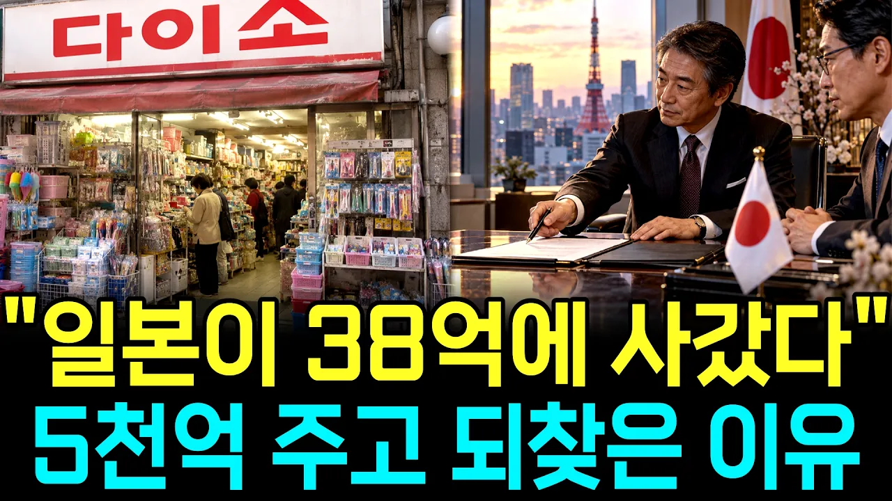

# 천원짜리 팔아 3조 찍은 다이소, 일본 지분을 5000억에 되산 진짜 이유

## 기본 정보
- **URL**: https://www.youtube.com/watch?v=Ccsm_weJ9PA
- **채널명**: 경제의 신호
- **구독자수**: 2만
- **조회수**: 346,656
- **업로드일**: 2026-09-25
- **영상 길이**: 23:42
- **댓글 수**: 97
- **좋아요 수**: 1,664

## 썸네일

---

## 댓글 (추천순 TOP 10)

| 순위 | 좋아요 | 댓글 |
|------|--------|------|
| 1 | 35 | 다이소 한국 회사 맞음...  옛날에 아성다이소가 다이소를 인수했음... |
| 2 | 3 | 아성다이소의 지분 구조 변천사와 토종 기업으로서의 정체성을 명확하게 팩트 체크해 주셨네요!  2023년 말 최대주주인 아성HMP가 일본 대주주의 지분을 전액 인수하면서 오랜 기간 따라붙던 일본 지분 논란을 완벽히 해소하고 명실상부한 100% 한국 기업으로 거듭났습니다. 시청자분들께 정확한 기업 역사 정보를 정리해 주셔서 진심으로 감사드립니다! |
| 3 | 2 | 몰랐던 일입니다. 다이소는 일본 기업인 줄 알았습니다. 최근 다이소를 자주 가 한 달 전 쯤 회원가입까지 했습니다. 1000 원 2000 원 짜리는 실망을  안 준딥다. ㅋㅋ |
| 4 | 10 | 가격대비  그렇게  좋운 물건을  싸게  파는곳이  없지요  불경기의 꽃  이지요 우리동네는 다이소도  망해서   철수 있어요 |
| 5 | 0 | 고물가·불경기 시대에 소비자들의 주머니 사정을 지켜주는 가성비 유통망의 핵심 역할을 정확히 짚어주셨네요!   말씀해 주신 대로 다이소는 대표적인 '불경기 특수(불황형 소비)' 리테일 기업으로 꼽히지만, 최근에는 상권 효율화 및 매장 대형화 전략에 따라 소형 동네 매장을 정리하고 인근 거점 대형 매장으로 통합·이전하는 흐름이 강화되고 있습니다. 자주 찾으시던 동네 매장이 사라져 아쉬움이 크시겠지만, 유통 환경 변화 속에서 체질을 개선하는 과정으로 이해해 주시면 감사하겠습니다. 소중한 피드백 감사드립니다! |
| 6 | 17 | 초심을 잊지말자. 다이소 헤어악세사리 그전만 못함ㅜ |
| 7 | 2 | 매장을 자주 찾고 애용하시는 실소비자의 솔직하고 애정 어린 피드백을 남겨주셨네요!   뷰티, 패션, 전자기기 등 신규 카테고리가 다변화되는 과정에서, 기존에 강점이 있던 소소한 생활 잡화나 헤어 액세서리 등 기본 품목의 디테일과 내구성을 놓치지 않는 것이야말로 실질적인 고객 신뢰를 지키는 핵심입니다. 초심과 내실 관리에 대한 이러한 쓴소리가 브랜드의 품질 관리 체계에 유용한 자극이 되길 바라며, 소중한 소견 공유에 진심으로 감사드립니다! |
| 8 | 0 | 돈만큼 생각해야지  몇배 몇십배 훨씬싸고  좋던데요 |
| 9 | 1 | ​ @baek6468 질이 계속 떨어짐, 전혀 이쁘지도 않아 |
| 10 | 6 | 1천원,2천원 짜리 팔아서 매출액이 4조원이라니! 그 많은 매장과 상품을 관리하는 능력이 대단하다. |
