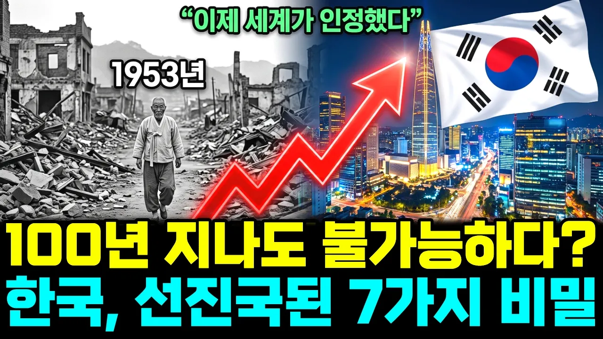

# 전 세계가 포기하라던 나라, 한국이 선진국이 된 숨겨진 7가지 비밀

## 기본 정보
- **URL**: https://www.youtube.com/watch?v=DA2tqWdqZTM
- **채널명**: 경제를 알리자
- **구독자수**: 199
- **조회수**: 59,831
- **업로드일**: 2026-09-24
- **영상 길이**: 14:53
- **댓글 수**: 19
- **좋아요 수**: 356

## 썸네일

---

## 댓글 (추천순 TOP 10)

| 순위 | 좋아요 | 댓글 |
|------|--------|------|
| 1 | 0 | 대한민국 화이팅!!! |
| 2 | 0 | 내용 중에 다 들어있는 이야기지만  은근과 끈기, 높은 아이큐, 근면성실성, 이런 것들도 충분히 이유가 될 것입니다. |
| 3 | 0 | 그때다러많아바려로죠 |
| 4 | 0 | 돌나라 유엔 한글특허로 한글 공통어 됐다 석선선생님 강의듣기 |
| 5 | 0 | 기ㅡ |
| 6 | 0 | 당연하지 무슨 첫수출품목이 자동차,반도체가 아니지 이걸 영상이라고. |
| 7 | 0 | 지금의 40대~60대가 멘땅에 헤딩하듯 산업화와 민주화를 이뤄냈는데 되도 않는 10~20대 수구매국노 일베충들이 감히 조롱 모욕 손가락질을 하고 있다는 게 어처구니가 없다. 국가발전엔 1그람도 기여한 게 없는 것들이.. 정말 어처구니가 없다. |
| 8 | 0 | 내용설명과 전혀 맞지 않는 화면이 아주 많아서 어색합니다~!😝 좀더 좋은 화면 자료를 수집해서 수준 높은 영상을 만들어 방송하길 바랍니다 ~!  농촌 부모님의 자식 교육열 설명에 서양 백인 아이들과 가족 모습도 너무나 이상하네요~!  이병철 회장님이 백인인가?  흑인 인가? 😝 |
| 9 | 0 | AI propaganda |
| 10 | 0 | 일본이 36년간 대한민국 강점에 따른 수천조 경제피해와 수탈 약탈 강제징용이 있었고! 미국 쏘련은 대한민국 분단의 원흉인데! 1919년 자유민주 대한민국건국한 김구주석 주도하에 미국쏘련이 도와주지 못했는데 |
