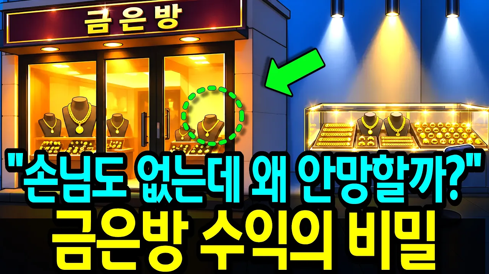

# 안 팔릴수록 부자되는 '동네 금은방'의 소름돋는 수익구조

## 기본 정보
- **URL**: https://www.youtube.com/watch?v=eFsT1K_mPjc
- **채널명**: 새파란 경제
- **구독자수**: 635
- **조회수**: 277,928
- **업로드일**: 2026-09-16
- **영상 길이**: 17:38
- **댓글 수**: 65
- **좋아요 수**: 730

## 썸네일

---

## 댓글 (추천순 TOP 10)

| 순위 | 좋아요 | 댓글 |
|------|--------|------|
| 1 | 5 | ✅ 끝까지 봐주셔서 고맙습니다.  평소에 궁금하셨던 것, 이런 건 왜 이런지 싶었던 것. 뭐든 편하게 남겨주세요. 다음 영상 만들 때 먼저 찾아보겠습니다. |
| 2 | 2 | 금거래 방식을 잘  배우고 갑니다 감사합니다 |
| 3 | 0 | 금 거래 구조를 이해하는 데 도움이 되셨다니 다행입니다 😊 끝까지 시청해주시고 좋은 말씀 남겨주셔서 감사합니다. |
| 4 | 7 | 오호 채널 뭔가 커질것같은데 ㅋㅋ 구독함 |
| 5 | 0 | 따뜻한 응원 덕분에 힘이 납니다 ㅎㅎ 구독까지 해주셔서 정말 감사합니다! 😊 앞으로도 재미있으면서도 도움 되는 경제 이야기 꾸준히 준비해볼게요. 같이 지켜봐 주세요! |
| 6 | 3 | 공부많이하셨네요 |
| 7 | 0 | 좋게 봐주셔서 감사합니다 😊 더 꼼꼼하게 공부해서 알기 쉽고 재미있는 경제 이야기로 찾아뵙겠습니다. 앞으로도 편하게 봐주세요! |
| 8 | 2 | 요즘에 금장시는 개털입니다  경기는 엉망진창 이고 큰일이네요 |
| 9 | 0 | 요즘 금값은 높아졌는데도 금은방 현장에서는 경기 침체를 체감하시는 분들이 많으신 것 같습니다. 금값과 실제 장사 분위기가 꼭 같이 움직이는 건 아니라는 점이 참 답답하게 느껴지네요. 걱정되는 마음으로 댓글 남겨주셔서 고맙습니다. 🙏 |
| 10 | 23 | 뭔 소리야 그것도 손님이 있어야 발생하지 가만히 진열한 제품에서 가공비,매입 차익 발생하냐 가만히 있으면서 발생하는 이익은  보유한 금값이 인상될때뿐 다른건 없어 손님이 와야지 뭔 귀신 씨나락까먹는 소린지. 참고로 금거래소 운영했던 사람 입니다 |
