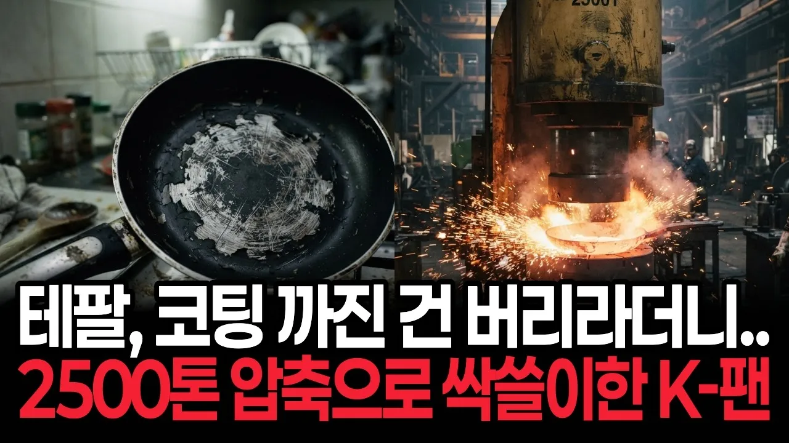

# 코팅 까지면 그냥 사라던 테팔.. 한국산 2500톤 압축 기술 적용한 K-프라이팬에 테팔 본사까지 발칵 뒤집힌 이유

## 기본 정보
- **URL**: https://www.youtube.com/watch?v=RzxbuBs5fsA
- **채널명**: 머니서바이벌
- **구독자수**: 1만
- **조회수**: 274,678
- **업로드일**: 2026-09-06
- **영상 길이**: 19:00
- **댓글 수**: 169
- **좋아요 수**: 1,667

## 썸네일

---

## 댓글 (추천순 TOP 10)

| 순위 | 좋아요 | 댓글 |
|------|--------|------|
| 1 | 32 | 하여튼 국산 후라이팬의 발전이 매우 유쾌하다. 대한민국 화이팅!!!❤❤❤ |
| 2 | 89 | 도루코~면도날 만든 검증된 업체 프라이팬도 잘 사용중~ |
| 3 | 20 | 도루코 후라이팬 좋아요 적당히 두껍고가운데가 꺼지거나 튀어나오지않고 훌륭합니다 |
| 4 | 66 | 테팔 넘 비싸 안쓰고 도루코 쓰는데 깜짝 놀랄 정도로 오래쓰고 있어서 왜 그런가 했더니 이런 기술력이 있어서 참 기쁨으로 영상 봤어요 앞으로쭉 국산 으로 쓸겁니다 좋은 영상 감사합니다 |
| 5 | 3 | 코팅된건가요? 스텐인가요? 도루코에서도 종류가 다양하던데 어떤거 쓰시나요? 인덕션용인가요?  가스렌지용인가요? |
| 6 | 54 | 몇일전에 냄비나 프라이팬등을 도루코로 다 교체 함...테팔 버림... |
| 7 | 88 | 요즘 누가 테팔 사나? 진심 개허접한 브랜드 |
| 8 | 1 | 테팔  고가여서  좋나보다  구입후   국산저가보다  못해서  과대광고였고  절대안산지가  10년이 넘었고  누가준다해도  거절   진짜  품질  최하 |
| 9 | 0 | 써보고서 말하나 국산 후라이펜 샀다가 얼마 안가서 코팅이 들고 일어나서 버리고 테팔 샀더니 코팅이 두꺼위서 오래 쓰더라 |
| 10 | 36 | 테팔 안쓴지 오래다. |
