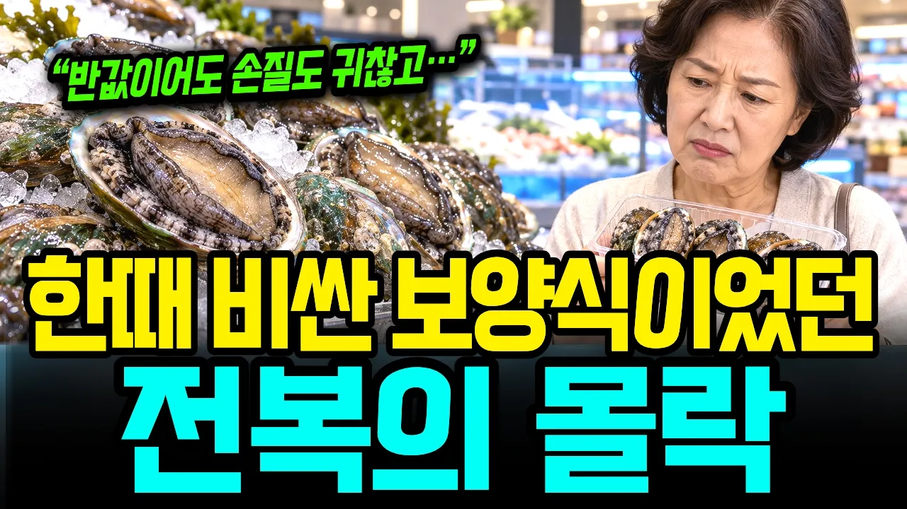

# 한때 비싸서 못 먹던 전복의 몰락, 값이 반토막 난 진짜 이유

## 기본 정보
- **URL**: https://www.youtube.com/watch?v=kkP6-8jm4tI
- **채널명**: 알지경제학
- **구독자수**: 912
- **조회수**: 341,224
- **업로드일**: 2026-09-21
- **영상 길이**: 24:40
- **댓글 수**: 359
- **좋아요 수**: 3,279

## 썸네일

---

## 댓글 (추천순 TOP 10)

| 순위 | 좋아요 | 댓글 |
|------|--------|------|
| 1 | 50 | 그런데도 전복하나 넣고, 비싸게 파는 음식점들.. 안사먹는다 |
| 2 | 0 | 어느 죽집에서도 보양식  운운하며 여전히 비싸게 팝니다 또다른 소비감소 현상으로 바다오염 과 양식 해산물에 대한 인식 때문인것같습니다 |
| 3 | 111 | 흔해졌다는데 여전히 비싸.. 추석전에도 추석 앞두고도 여전히 모두 비쌈 |
| 4 | 14 | 맞아요. 예전보다 흔해졌다고 해도 소비자 입장에서는 여전히 비싸게 느껴지죠. 특히 명절 앞두면 더 그런 것 같습니다. 😊 |
| 5 | 19 | 전복 비싸게 팔아먹던 시절. 전복 양식장 주인들 독3사 차들 타고 다녔음 |
| 6 | 68 | 아니.  도대체 전복이 무슨 맛이지 비싸다는것은 둘째고 맛을 모르겠음 |
| 7 | 4 | 저도 그래요 ~ 전복이 무슨맛인지 모르겠더라고요 ~;; 그냥 식감 때문에 먹는거 아닐까요 ? 쫄깃 쫄깃한 식감 |
| 8 | 3 | 맛도 없고  알러지 유발  전복 |
| 9 | 2 | ​ @송이-s1f 타이어 재질 고무판에 붙여서 키우니 알러지 날수밖에 |
| 10 | 2 | 전복죽 맛없던데 왜 먹는지 모르겠음. 소고기죽이나 닭죽이 훨씬 맛있는 듯. |
