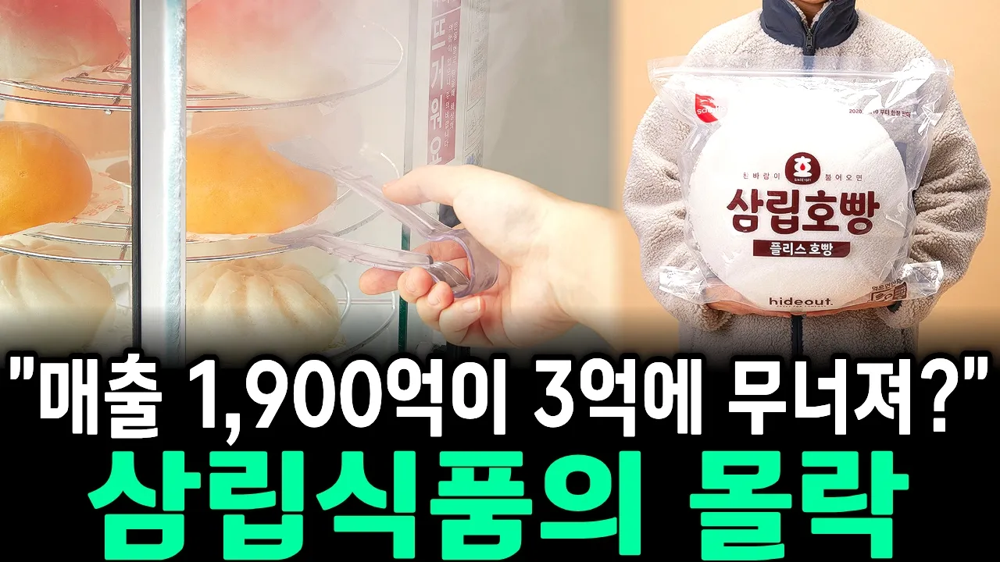

# 매출 1,900억 회사가 단돈 3억에 무너진 진짜 이유: 삼립식품의 몰락

## 기본 정보
- **URL**: https://www.youtube.com/watch?v=9T2yLzqeRfU
- **채널명**: 무궁화경제
- **구독자수**: 1만
- **조회수**: 467,276
- **업로드일**: 2026-09-25
- **영상 길이**: 21:22
- **댓글 수**: 349
- **좋아요 수**: 2,450

## 썸네일

---

## 댓글 (추천순 TOP 10)

| 순위 | 좋아요 | 댓글 |
|------|--------|------|
| 1 | 100 | 2022년 교반기에 몸이 딸려가 사망한 여직원 장례식장에 조의금답례품으로 장례식 금기음식인 단팥빵을 나눠준 SPC |
| 2 | 11 | 2022년 교반기에 몸이 딸려가 사망한 여직원이 사용했던 기계를 비닐로 가리고 그 옆에 있던 같은 용도의 다른 교반기를 다음 날부터 돌려서 매출을 올렸던 회사야. SPC는 상상을 초월하는 회사다. |
| 3 | 11 | 대한민국 빵값 죄다 올려 놓은게 파리 바게트 그리고 파리바게트가 독점하면서 했던 나쁜짓들 이미 장사 잘되던 동네 빵집에 가서 너 파리바게트 상호 달아라. 거절하면 바로 옆에 파리바게트 입점하겠다 할래? 말래? 거절하면 진짜 바로 옆에 파리바게트 입점시켜서 빵을 겁나게 헐값에 팔아서 결국 기존 빵집 문 닫게 함 |
| 4 | 53 | 절대 먹지 않는 파리바게트 베스킨라빈스  산재는 범죄다 제대로 안전하게 장사해라 |
| 5 | 2 | 그건 니네  회사도 마찬가지야 ! 니네 회사도 범죄 회사면서 같은 기업끼리 아닌척은 ! 니네 회사도 안전한 회사가 아니야 ! |
| 6 | 2 | ​​ @CHL-b6i  사람을 죽이지는 말아야지! ㅋ 똑같이 위험해도 사람 안죽는 회사는 욕을 안먹어! 중요한건 그거야! |
| 7 | 1 | ​ @외밤톨이  그건 아니지 않냐 ! 위험한데 어떻게 욕을 안먹냐 ! 니 생각 잘하고 답글  달어라 ! 어딜 말도 안되는 소릴하고 있어 ! |
| 8 | 2 | ​ @외밤톨이  니 나한테 답글 달다가 욕 겁네먹네 ! 차라리 달지말지 그랬어 ? |
| 9 | 0 | ​ @CHL-b6i 하 하 결과로 판단하는게 세상사야! 아직 어린거 같은데 나한테 배워라.  쇳물이 철철 흐르고 불똥이 튀는 작업도 사람 안죽으니까 말이 없는거야. 사실이 그런데 무슨 잡설이 필요해? |
| 10 | 2 | 니가 생각하는 그결과가 무슨 소용이 있냐 ! 무조건 결과로만 판단하는게 그게 세상사냐 ? 결과도  중요하지만 과정도 결과만큼 중요한거야 ! 그 과정이 회사가 얼마만큼 사고에 대한 과실이 있느냐 없느냐 아니면 사고 당사자가 얼마만큼 과실이 있느냐 없느냐에 따라서 그 결과로 회사 욕을 해야지 앞뒤 안가리는 니같은 애송이들이 떠든다고 SPC 가 망할꺼 같냐 ! 진짜 SPC가 망하길 원하면 확실한 책임을 질만한 근거와 결과를 가지고 와라 ! 무조건 확실한 근거와 결과없이 사람이 죽었다면서 망하길 바라지만 말고 ! 알긋냐 ! 하긴 애송이가 뭘 알겠어 ! 그리고 회사측에서 그만큼 안전에 대해서 교육을 했어도 작업자들이 그대로 하던 방식데로 회사규칙을 억여가면서 기존에 옛날 방식대로 작업을 하다가 사고가 난건데 무조건 회사 책임으로 돌리는건 아니지 않냐 ! 회사가 사람 죽으라고 한것도 아니고 본인 부주의로 작업을 하다가 사고가 난건데 본인 책임도 있지않냐 ! 물론 안전관리 못한회사 책임도 있지만 본인 부주의 과실이 더 큰걸로 알고 있는데 ! |
