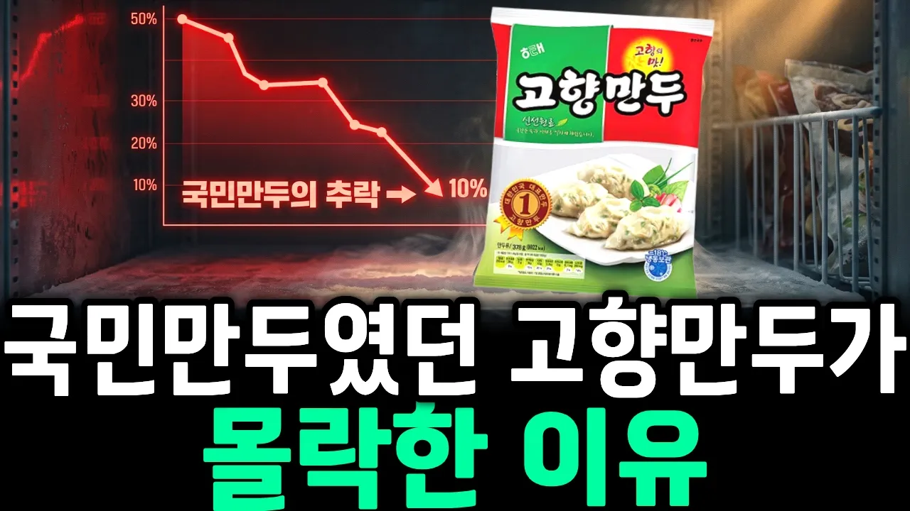

# 국내 최초 냉동만두의 몰락… 고향만두가 놓친 단 하나

## 기본 정보
- **URL**: https://www.youtube.com/watch?v=-8_9yYNB_lw
- **채널명**: 무궁화경제
- **구독자수**: 1만
- **조회수**: 82,076
- **업로드일**: 2026-09-18
- **영상 길이**: 20:06
- **댓글 수**: 47
- **좋아요 수**: 265

## 썸네일

---

## 댓글 (추천순 TOP 10)

| 순위 | 좋아요 | 댓글 |
|------|--------|------|
| 1 | 8 | 고향만두만 먹음 |
| 2 | 5 | 원래 도투락이라는 회사의 만두가 고향만두였고 도투락이 부도를 맞고 해태에서 만두부분만 인수한 것으로 알고 있는데 애초 해태가 만든 레시피도 아닙니다 도투락이라는 회사에서 만든것이죠 |
| 3 | 4 | 난 그래도 아직도 고향만두만 먹는데😊 |
| 4 | 5 | 비비고가 무난~😮 |
| 5 | 6 | 너무 맛없어 비비고가 수준을 높여버림 |
| 6 | 5 | 처음 나왔을때부터 먹었었는데 요즘도 가끔 먹어 보면 옛날 맛이 안남 겁나 맛없어짐 예전 속이 꽉찬 고향만두 라고 광고했었는데 지금은 속이 텅빈 만두 |
| 7 | 3 | 저는 처음 들어보는 만두네요 비비고 만두 풀무원만두만 먹어봤어요 |
| 8 | 0 | 03년 군생활 이병노란견장 시절,.  px에서봉지안에다  물 조금 넣고 전자렌지에 돌려서 사 먹였이던 선임과 그 맛이 생각나고 좋았는데 그때. 만두가 제일 맛있게 느껴졌였는데.. 지금은 어떨지.. 요새 군대밥도 잘 나오는거 같아서 |
| 9 | 3 | 너무 맛이  없어 안 사 먹어  납작 만두같은 경우 당면 말고 거의 없어도 더  맛있다 |
| 10 | 0 | 난 동원을 먹음 솔직히 나도 옛날에 먹던거라 이걸 좀 더 먹는편인데 고향은 진짜 너무 옛날거같음 |
