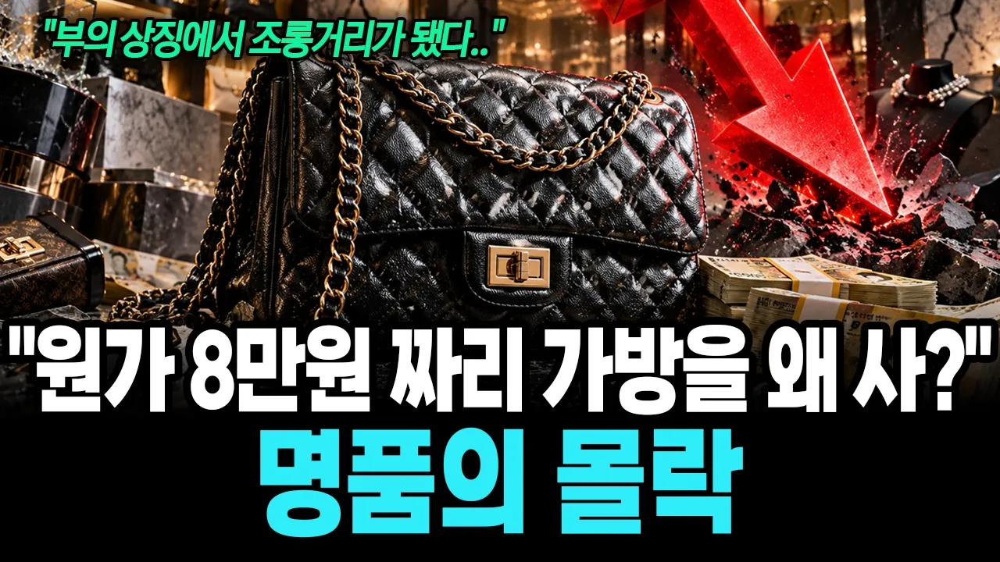

# 원가 8만원을 400만원에 팔다니.. 부의 상징에서 웃음거리까지 추락한 명품시장 | 명품의 몰락

## 기본 정보
- **URL**: https://www.youtube.com/watch?v=hiWuI0NhTpg
- **채널명**: 경제야 고맙다
- **구독자수**: 2,810
- **조회수**: 126,449
- **업로드일**: 2026-09-29
- **영상 길이**: 31:47
- **댓글 수**: 90
- **좋아요 수**: 418

## 썸네일

---

## 댓글 (추천순 TOP 10)

| 순위 | 좋아요 | 댓글 |
|------|--------|------|
| 1 | 43 | 이제 이런 사치품 들고 다니면 촌스러워요 |
| 2 | 22 | 없는 사람들이 사는게 문제지 있는 사람들은 사던지 말던지 |
| 3 | 37 | 명품보다  저딴 명품에 환장하는 허영심 가득한 여자를 만나지 않는게 더 중요하다..패가망신의 지름길 |
| 4 | 23 | 가방이 오천만원 하던지 일년에 가격을 50번올 올리던 아무관심 없어짐 |
| 5 | 29 | 명품 갖고 다니면 사람들이 더 이상하게 보니 안사게 되지 |
| 6 | 1 | 명품  중국에서 중국인이 하땀한땀 정성스럽게 만들지~ |
| 7 | 19 | 명품이 뭐 필요 있나… 명품 열풍은 이미 식었죠 |
| 8 | 9 | 명품은 아니라도   메이커 옷 신발  아니면      몸 에 안걸친다   초등 부터   저축 보다  소비를 부추기는 대한민국 |
| 9 | 3 | 적당한 소비하고 재산적인 가치가 있는데 투자하는게 현명한거죠 제정신으로 돌아왔네요  다행 |
| 10 | 6 | 가방에 1백만 넣고, 10원이 늘어도 난 산다.ㅋㅋㅋㅋㅋ |
