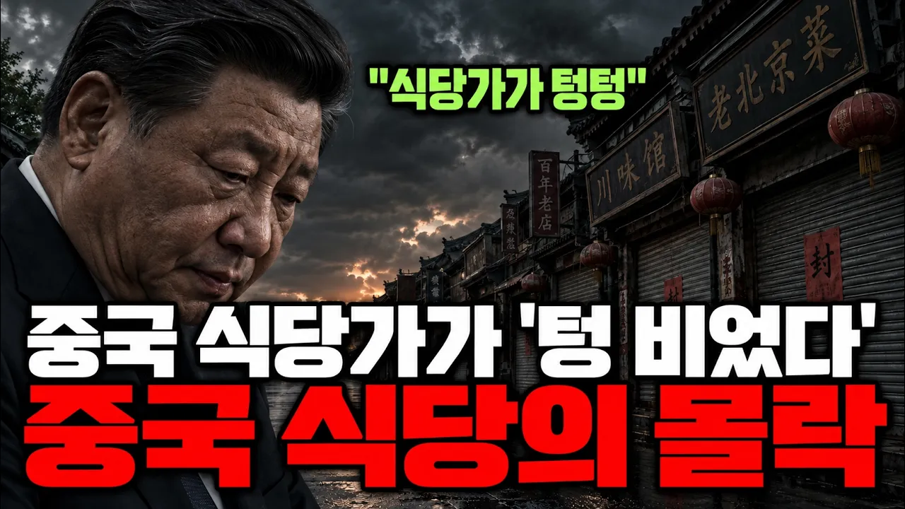

# 중국 식당가가 텅 비고 있다. 하루 1만 곳이 문 닫는 중국 식당 몰락의 진짜 이유

## 기본 정보
- **URL**: https://www.youtube.com/watch?v=I7bAaKgEWI0
- **채널명**: 채굴경제
- **구독자수**: 575
- **조회수**: 206,904
- **업로드일**: 2026-09-27
- **영상 길이**: 26:28
- **댓글 수**: 86
- **좋아요 수**: 1,871

## 썸네일

---

## 댓글 (추천순 TOP 10)

| 순위 | 좋아요 | 댓글 |
|------|--------|------|
| 1 | 24 | 여러분 동네에서 최근 문을 닫은 가게는 어떤 곳이었나요? |
| 2 | 15 | 이건 중국만의 문제가 아닙니다. 전 세계적인 추세예요.... 이제 서서히 ... 겨울이 오고 있어요... 시간이..거의 다 됐습니다. |
| 3 | 17 | 중국 식당은 먹을때가없다 너무 10:12 10:17 많은 화확제품이  첨가 되기 때문이다  그리고 빵. 아이스크림은 더 심하다 상상을 초월한다 |
| 4 | 34 | 배달음식 정말 비위생적 배달음식만드는곳 지나다 보면 주방에  위생 자체가 없는곳 배달음식 절때 안시켜 먹는다. |
| 5 | 4 | 배달이제 끝입니다 |
| 6 | 30 | 중국식자재가  독극물 인데 먹고 죽고싶겠냐 그 독극물이  국내에 너무많이 들오온다고 식당가기가  겁이난데요 글세~ 어쩌다가 이지경까지 |
| 7 | 0 | 국회의원들 문제가 국민을 울리죠 ㅡㅡ |
| 8 | 52 | 중국얘기가 아니라 우리나라 얘기 같다. 이 얘기가 사실 이라면 한국도 중국 경제 처럼 몰락해 가고 있는거다. 남의 나라 얘기라고 가볍게 들을 게 아니다 |
| 9 | 0 | 한국식당가기가 겁난다 중국김치.중국고추가루 그리고 식자제 의심스럽다보니 가급적이면 외식을 줄이고 있읍니다 |
| 10 | 12 | 우리나라도 똑같다  그리고 불경기다 |
