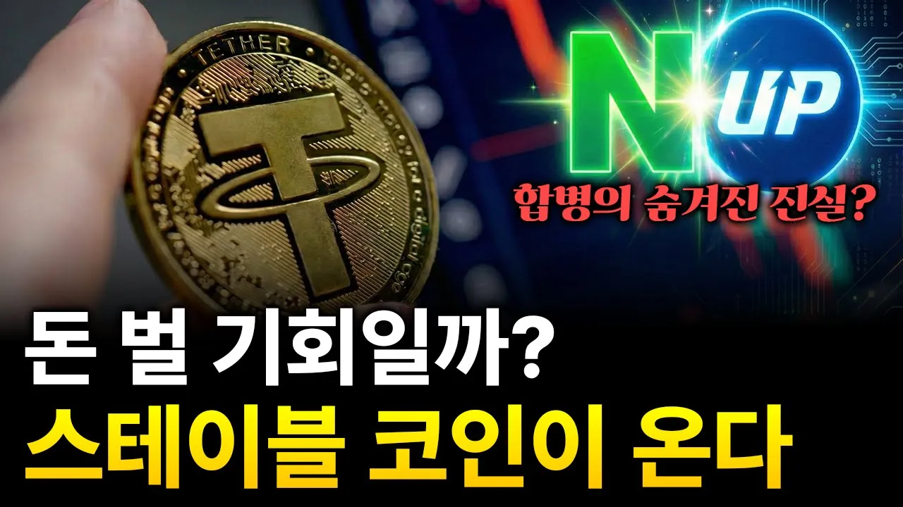

# 거대한 돈이 움직인다. 한국 기업들의 스테이블 코인 전쟁?

## 기본 정보
- **URL**: https://www.youtube.com/watch?v=NJHwYa2UB_M
- **채널명**: 경제학 똑똑
- **구독자수**: 26만
- **조회수**: 8,724
- **업로드일**: 2025-11-29
- **영상 길이**: 10:52
- **댓글 수**: 17
- **좋아요 수**: 212

## 썸네일

---

## 댓글 (추천순 TOP 10)

| 순위 | 좋아요 | 댓글 |
|------|--------|------|
| 1 | 0 | 돈 버는 멤버쉽 지금 바로 합류하기
 https://m.site.naver.com/22UV5
 
 경제학똑똑 같은 유튜브 만드는 법
 https://forms.gle/R111vSh3S5p3z6Rk7 |
| 2 | 11 | 테더 한순간에 한방에 훅간다에 한표 ㅎㅎ |
| 3 | 16 | 자국화폐가치 추락.  그 어려운걸 이창용 한국은행 총재가 지난 임기 4년동안 해냈습니다. |
| 4 | 0 | 훠훠훠. 제가 심어놓은 제 샤람이쥐효. 애들아 고맙다. 아니아니 나는 해물짬뽕 |
| 5 | 0 | 누가 돈을 그리 풀었는가 |
| 6 | 4 | 이재명이 했지 |
| 7 | 2 | 1분전 못참지 |
| 8 | 0 | 오지게 잼있다… |
| 9 | 1 | 스테이블 코인 뭐 사야 해요? |
| 10 | 2 | 이더리움 천만원 간드아!! 이제 시작이다 진짜. 참고로 코인 2주차 ㅋㅋㅋ 톰리가 간댔다구~ |
