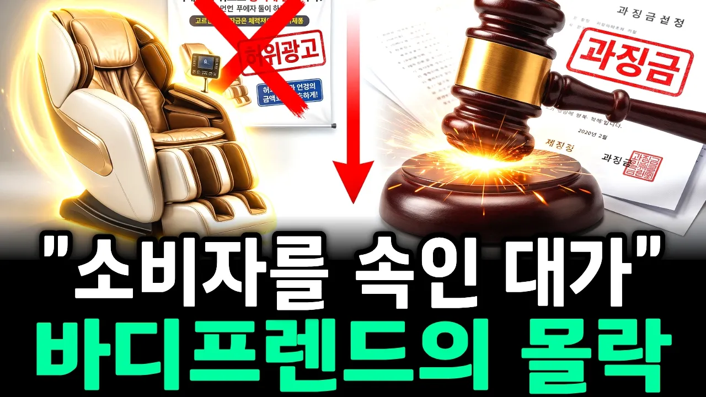

# 6천억 신화의 몰락…안마의자 황제 바디프랜드는 왜 무너졌나

## 기본 정보
- **URL**: https://www.youtube.com/watch?v=Jo1j36x1mO4
- **채널명**: 무궁화경제
- **구독자수**: 1만
- **조회수**: 100,967
- **업로드일**: 2026-10-01
- **영상 길이**: 16:50
- **댓글 수**: 52
- **좋아요 수**: 420

## 썸네일

---

## 댓글 (추천순 TOP 10)

| 순위 | 좋아요 | 댓글 |
|------|--------|------|
| 1 | 34 | 비싸고  부피크고   무거우니 생각은비슷 한듯 |
| 2 | 28 | 사면 쓰레기가 됩니다. |
| 3 | 17 | 아직도홈쇼핑에서판매하는데a/s는 어디서하나? 바디프렌드사지말아야 |
| 4 | 24 | 나중에 버리기 어렵다.. |
| 5 | 7 | 바디프렌드 모델중  중국산 안마의자 수입원가가 약 150만원 안밖임 |
| 6 | 9 | 바디프렌드나 기타 잡다한 안마 회사나 똑같아요. 무조건 비싸게 호구하나 걸려라 식이니..고장나면 as도 힘들구 |
| 7 | 4 | 이사갈 때 분해해야 하고 이사가서 다시 조립해야 하는데 부분적 분해 조립하는데 많게는 40만원까지 달라고 해서 버렸습니다. 그리고 주변에서 산다고 하면 절대 말립니다. |
| 8 | 7 | 자업자득 이네~ |
| 9 | 4 | 안사기 다행 |
| 10 | 4 | 양심불량 기업.. 언제 망하나 했는데. 잘됐다 |
