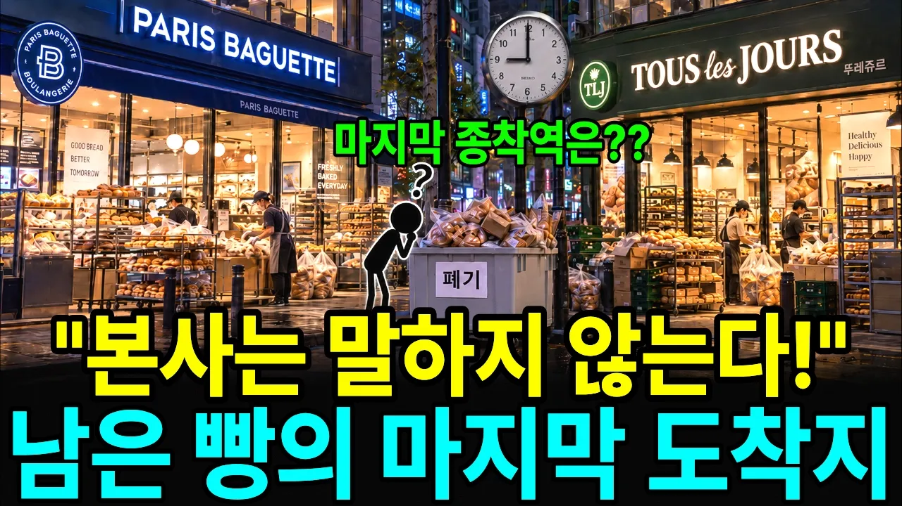

# 밤 9시 파리바게트 뚜레쥬르 남은빵의 행방은? 끝까지 따라가 봤습니다.

## 기본 정보
- **URL**: https://www.youtube.com/watch?v=DksiXKLq1Hk
- **채널명**: 스피드경제
- **구독자수**: 8,230
- **조회수**: 488,234
- **업로드일**: 2026-10-02
- **영상 길이**: 17:14
- **댓글 수**: 187
- **좋아요 수**: 1,507

## 썸네일

---

## 댓글 (추천순 TOP 10)

| 순위 | 좋아요 | 댓글 |
|------|--------|------|
| 1 | 105 | 지하철 빵 전원짜리 확인하면 중국산이 많아요 |
| 2 | 11 | 시장 중소 마트에 깔린것도 중국산 많더라고요~ 어떤 분이 영상 올려주셔서 그담부턴 확인하고 안삽니다~ 찐 옥수수 1000원짜리도~ |
| 3 | 0 | 다중국산1000원빵 |
| 4 | 2 | 중국산 빵이 언제 어떻게 수입되나요? |
| 5 | 13 | ​ @들어들어 누군가 수입하니 들어오겠죠~ 유통기한이 무지 길어요 방부제등을 섞는걸로 알아요 반드시 확인하고 국내산 드세요~ |
| 6 | 0 | 중국산 아니다. 식약처에서 조사결과 안전한 걸로 나왔다 |
| 7 | 13 | ​ @빽초보 포장지 뒷면에 중국산이라고 표기되어 있음요~ |
| 8 | 173 | 빵집  안간지 오래..  맛 없고 달기만 하고 비싸기만 하고.. 안 먹음 |
| 9 | 8 | 마자요 그게그거 거기서 거기 손가는게 없어요 |
| 10 | 0 | 나도 비싸서 안 사먹음. 게다가 파바, 뚜레쥬르 브랜드느가 그간 한 나쁜  일들이 싫어서 |
