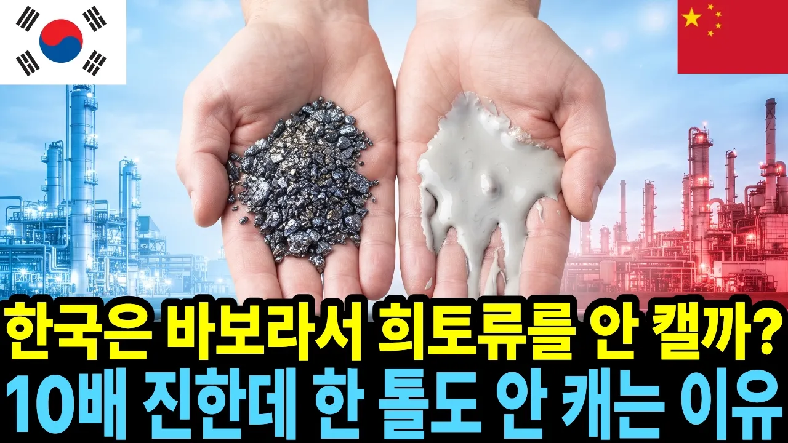

# 우리 땅 희토류는 묽어서 못 캔다더니, 중국은 10배 더 묽은 흙을 캡니다 | 한국 희토류 매장량

## 기본 정보
- **URL**: https://www.youtube.com/watch?v=B2o52NGldAk
- **채널명**: 경제픽톡
- **구독자수**: 125
- **조회수**: 113,130
- **업로드일**: 2026-09-29
- **영상 길이**: 16:41
- **댓글 수**: 29
- **좋아요 수**: 484

## 썸네일

---

## 댓글 (추천순 TOP 10)

| 순위 | 좋아요 | 댓글 |
|------|--------|------|
| 1 | 5 | 캐는 몫은 60퍼센트인데 거르는 몫은 91퍼센트입니다. 이 차이가 이 영상의 전부입니다.  그래서 여쭤봅니다. 지금 우리가 돈을 써야 할 곳은 땅일까요, 설비일까요. |
| 2 | 5 | 희토류 1톤을 얻을려면 치명적인 오염물이 1000톤이 나온다고 들었습니다 |
| 3 | 0 | 와 대충 5분도 안되는 내용을 이렇게 주저리주저리 길게 늘리는 것도 능력이다. |
| 4 | 1 | 환경이 먼저냐 돈이 먼저냐 나라마다 생각의 차이일뿐 희토류 1톤 생산에 수천톤의  독성 폐수와 방사선 폐기물이 발생함 중국이 많이 생산할뿐 중국엔 희토류를 생산하면서 생긴 방사능 오염수를 모아놓은 호수가 있음 |
| 5 | 5 | 저는 설비 쪽에 1표 던지네요. 땅은 파보다 없으면 시간과 돈과 노력이 물거품이 되지만  설비는  원석을 사들여  철을 뽑아내는  포항제철 처럼  지속적인 운영이 가능하지 않을까 생각해 봅니다. |
| 6 | 3 | 희토류를 축출하는데 엄청난 환경오염 물질인 폐기물이 나온다고 한다. 미국에도 희토류 매장량이 많으나  이런 환경적인 영향 때문에 캐지 못하고 있는 것이다. 환경문제에 민감하지 않은 중국이니까 가능한 것이다. |
| 7 | 3 | 사서 쓰는게 더 싸니까 지금같이케면 손해보구 팔아야하고 오히려 환경오혐 문제도있고 팔면서 손해보니까 중국이 물량이 다떨어지면 그때 케서쓰면 비싸게 팔수있으니 구지 지금케서 중국이랑 경쟁해봐야 손해고 그회사는 바로 문닫음 |
| 8 | 3 | 미국도 중국의 희토류 수입 합니다 왜 희토류를 캐지 않을까요??? 희토류를 가공하는 방식좀 생각 하셔야죠 |
| 9 | 1 | 쓸데 없는 비유가 많다. |
| 10 | 0 | 환경오염은비탈이고 없다그냥 둘째가술자도없다 셋째희토류빼낼후있는 장비기계도없다 무인기도못만들고있는데 거짓이다 없다아예 |
