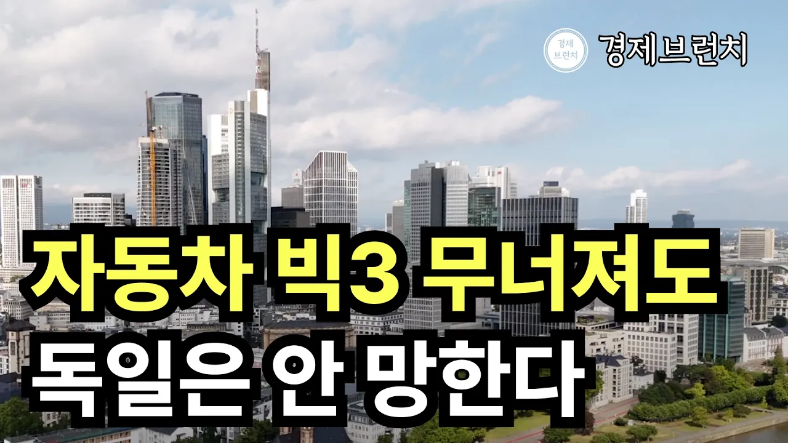

# 독일 자동차 빅3가 휘청여도 독일경제가 버티는 진짜 이유 ⎮지식으로 읽는 경제

## 기본 정보
- **URL**: https://www.youtube.com/watch?v=liSTzWf676s
- **채널명**: 경제 브런치 : 지식으로 읽는 경제
- **구독자수**: 1,290
- **조회수**: 27,738
- **업로드일**: 2026-10-04
- **영상 길이**: 15:09
- **댓글 수**: 44
- **좋아요 수**: 200

## 썸네일

---

## 댓글 (추천순 TOP 10)

| 순위 | 좋아요 | 댓글 |
|------|--------|------|
| 1 | 9 | 독일 출장을 자주 가는 편인데... 남의 나라 걱정할 것은 아니지만 몇년전과 비교하면...체감합니다 |
| 2 | 21 | 원천기술이 있는 나라는 망하지 않는다. 다만 침체할 뿐이다. 망하는건 원천기술없이 하청에 의지하는 나라이다. |
| 3 | 0 | ㅅㅍ 그럼 중후진국들은  다 망했겠네..각자 형편껏 사는게 망한거냐 |
| 4 | 0 | 원천기술도 핵 앞에서는 무기력 |
| 5 | 8 | 현재 독일기업들 고령화와 승계난,여기에다 에너지 가격 급등과 ai와 같은 소프트웨어기술 투자금의 어려움등의 발생하면서  수많은 독일 기업들이 외국기업들에 인수되고 있는상황인데  한국의 기업들이 특히 독일의 이런 기업들을 많이 인수하고 있는 상태  독일에서도 중국기업들에 인수되는거 보다는 한국기업에 인수되는게 낫다는 인식이 있어서 한국기업들의 독일기업 매입이 엄청 많아졌다고 함 |
| 6 | 4 | 삼전닉스 불과 2~3년전에 적자였다~ 우리 망했냐?ㅜㅜ 일개 기업 실적으로 나라는 망하지 않는다 |
| 7 | 1 | 아니 그게 아니고 느그는 저출산고령화도 있음 |
| 8 | 2 | 독일에서 회사생활하고 있습니다. 독일 경제가 쉽게 무너지지는 않을겁니다만 위기인 것은 사실입니다. 특히 80-90년대 압도적인 기술 격차로 만들어 두었던 기술적 해자가 후발 국가들, 대표적으로 한국, 중국, 대만 등에 의해 빠르게 따라잡히고 있는 중이고요, 소위 차세대 먹거리라고 하는 AI, 반도체, 바이오 등에서는 과거 기계공학 분야 수준의 영광을 누릴만한 기업이 없습니다. 우리가 독일 걱정해 줄 팔자는 아닙니다만 위기인 것은 사실입니다. |
| 9 | 3 | 독일은 제약 화학 기계 금속 전자 부품 소재 완성품등 거의 모든 부분에서 세계최고의 기업들이 있음. 일본도 비슷하나 두나라는 비슷하면서 결이 조금 다름. 독일 일본 걱정하는 사람들은 경제 특히 제조업을 전혀 모르는 사람들임. |
| 10 | 3 | 독일의 특징은 아주 큰 대기업의 숫자는 그리 많지않다. 그대신 수많은 강소기업들이 있다.  각자 남들이 넘보지 못하는 니치 마켓의 독특한 제품을 만들어 판다. 각기 긴 역사와 전통을 자랑하고  장인정신, 장인을 키우는 법체계, 그것을 받치는 교육체계가 있다.  이런것을은 쉬 사라지지 않고  다른 국가가 복사하기 어렵다. |
