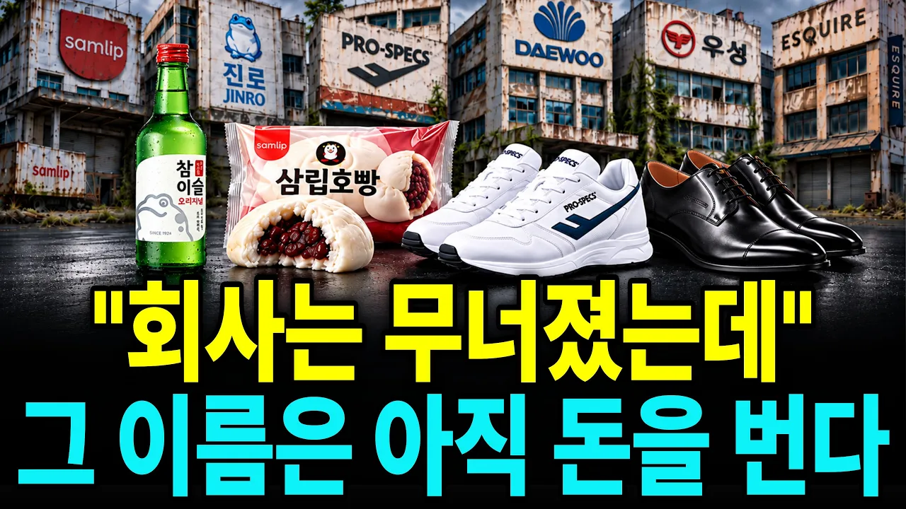

# “1등 제품도 회사를 못 살렸다” 진로·삼립·대우가 무너진 진짜 이유

## 기본 정보
- **URL**: https://www.youtube.com/watch?v=2m1HOX9S2eQ
- **채널명**: 그런 경제
- **구독자수**: 3,390
- **조회수**: 14,623
- **업로드일**: 2026-10-08
- **영상 길이**: 21:27
- **댓글 수**: 18
- **좋아요 수**: 354

## 썸네일

---

## 댓글 (추천순 TOP 10)

| 순위 | 좋아요 | 댓글 |
|------|--------|------|
| 1 | 0 | 국가부도는 아침에 발생하는것이 아니죠 ᆢ |
| 2 | 0 | 정말 재미있는 얘기네요 |
| 3 | 0 | 재미있게 보셨다니 반갑습니다. 끝까지 봐주셔서 고맙습니다. |
| 4 | 4 | 지금도 진로 소주를 마시는 귀족들이 있네요 우리는 서민이라 맥주 양주  것도 도수약한 것으로  그럼 일회용  커피믹스  어마무시 하겠다 나도마시고 너도마시고  어쨌든   돈많은 귀족들아 깡소주   주야장창 마셔라 요즘 젊은이들은 도수약한 소주조금 그리고 소주와  알콜을 거의 마시지 않는다 회식도 거의하지 않는다 |
| 5 | 1 | 깡소주만 드시는 분보다 도수 낮은 술을 찾는 분이 늘었다는 말씀, 요즘 분위기를 잘 짚으셨네요. 회식이 줄었다는 것도 공감합니다. 다만 이 영상은 소주 판매 흐름보다 진로가 왜 쓰러졌는지 장부를 따라가 본 이야기입니다. |
| 6 | 3 | 하이트맥주는 별로라 안마심 |
| 7 | 0 | 입맛은 사람마다 다르니까요. 하이트진로는 2005년 하이트맥주가 진로를 3조 4,288억 원에 인수하면서 생긴 이름입니다. |
| 8 | 0 | 은행이 문제지 꼭 연대보증을 하라고 강권하거든 |
| 9 | 0 | 정확하게 보셨습니다. 영상에서 진로는 계열사끼리 서로 보증을 서면서 계열사 출자·대여·보증이 2조 원을 넘었고, 삼립도 계열사 회사채 지급보증이 750억 원이었습니다. 남의 빚에 찍은 보증이 회사를 무너뜨린 결정타 중 하나였다는 게 영상의 결론입니다. |
| 10 | 1 | 프로스팩스는 전두환이 말아 멉었지...😢 |
