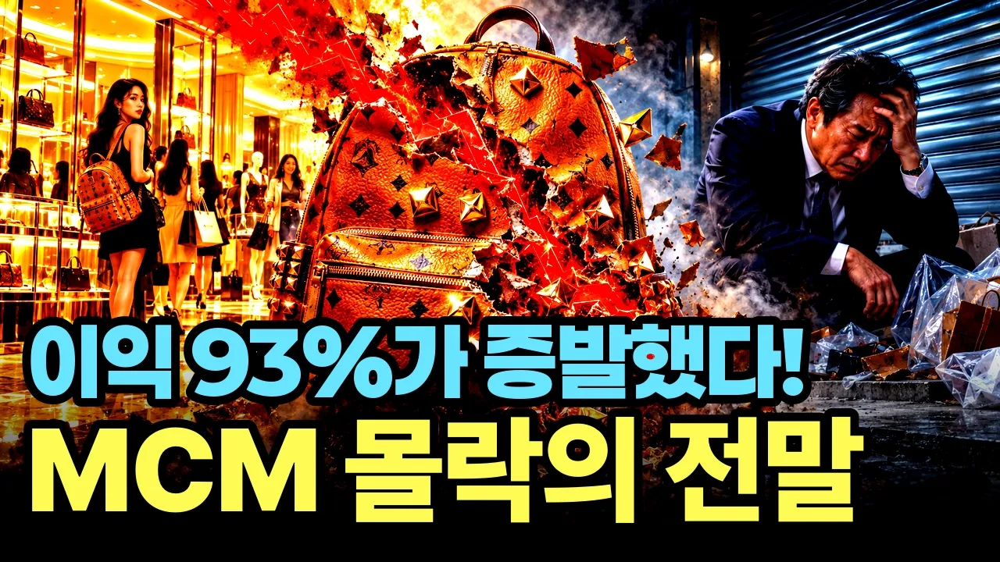

# MCM의 몰락 "중국 유커만 믿는다"며 한국 손님 버렸다가 폭망한 이유

## 기본 정보
- **URL**: https://www.youtube.com/watch?v=m_hIWavlga4
- **채널명**: 경제꽈배기
- **구독자수**: 2,200
- **조회수**: 35,155
- **업로드일**: 2026-10-09
- **영상 길이**: 20:08
- **댓글 수**: 33
- **좋아요 수**: 154

## 썸네일

---

## 댓글 (추천순 TOP 10)

| 순위 | 좋아요 | 댓글 |
|------|--------|------|
| 1 | 24 | 키워준 한국고객 내팽개치고 중국에만 눈 돌리다 쫄딱 망한 케이스...자업자득~ |
| 2 | 13 | 중국과 엮이면 다 나락 가는게 국룰 |
| 3 | 0 | 확실히 중국 시장 의존도가 높았던 기업들이 비슷한 어려움을 겪는 경우가 많죠. |
| 4 | 12 | 독일 방만한 경영으로 한국으로 팔려서 한국 방만한 경영으로 브랜드가 사망했네 |
| 5 | 15 | 박재범이 광고하면 다 망하는듯 |
| 6 | 9 | mcm 도 진짜 추억의 브랜드네 |
| 7 | 8 | 명품은 무슨..명품 흉내내며 인지도 한껏 올려 한탕 거하게 해먹고 턴거지.. 처음부터 명품 만들어 백년갈 생각은 추호도 없었던 거야.. |
| 8 | 0 | 브랜드 전략에 대해 안타깝게 보시는 분들이 많네요. |
| 9 | 5 | 딱 보면 언제 나왔는지 알 수 있는... 클래식이라는 게 없는 자극적인 디자인... 유행지나면 못들고 나가는 유행템 당시 매장에 들어가면 이런 느낌이 들곤 했다.... 오래 가기 어렵겠네 망하라는 얘기가 아니고 제품에 비해 몸집을 너무 키웠다는 얘기입니다. |
| 10 | 9 | Coach수준이 그이상의 급인냥 마케팅해서 망함 |
