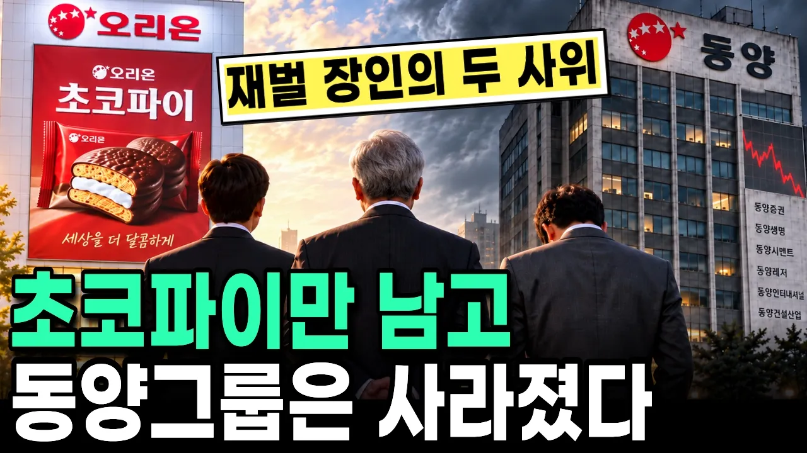

# 검사 출신 첫째 사위와 화교 출신 둘째 사위, 장인이 물려준 두 회사 중 하나는 무너지고 하나는 매출 3조가 된 이유

## 기본 정보
- **URL**: https://www.youtube.com/watch?v=t1YYQIE2WE0
- **채널명**: 몰랐던 경제
- **구독자수**: 3,490
- **조회수**: 96,540
- **업로드일**: 2026-10-04
- **영상 길이**: 20:28
- **댓글 수**: 26
- **좋아요 수**: 349

## 썸네일

---

## 댓글 (추천순 TOP 10)

| 순위 | 좋아요 | 댓글 |
|------|--------|------|
| 1 | 1 | 📺 앞 이야기 👉 https://youtu.be/13K9Qc25os8 초코파이 회사를 받은 둘째 딸은 살아남고, 그룹을 물려받은 첫째 딸은 무너진 동양그룹의 갈림길  명절 선물 상자, 군대에서 나눠 먹던 기억, 케이크 대신 초를 꽂았던 생일. 초코파이와 관련된 기억들을 누구나 가지고 있는 것 같아요.  이번 영상은 그 초코파이 뒤에 있던 한 집안의 이야기예요. |
| 2 | 24 | 첫째 사위는 검사 출신 이라서 엘리트 의식에 쩔어서 인맥으로 다 될줄 알고 방만하게 경영 했기에 망한거임. |
| 3 | 10 | 회사를 경영하려면 뭔가 결과를 내고 또한 그룹을 인화하려는 리더십이 있어야 합니다. 제가 보기에 첫째 사위는 사주 상 또는 본인의 성향 상 관(정관, 편관)과 인(정인, 편인) 같은 학구열이나 조직의 위계는 있었겠지만 돈에 대한 감각인 재성이 없었으며 오히려 젊은 나이에 그룹의 꼭대기에 올라간 게 독이 됐을 겁니다. 본인의 자만심과 이른 성취감으로 산업을 연구하고 같이 하려는 노력보다 누리려는 성향이 강해지면 그때는 돌이키기 쉽지 않습니다. 둘째 사위는 화교출신이어서 기본적으로 재성(정재, 편재)는 있었으며 그 산업에게 경험하며 체득하고 본인의 그릇을 키우며 기다려서 나중에 올라간 것이 복이 됐을 겁니다. 겸손하며 배우고 체득하며 알려고 노력하지 않으면 세상에 쉬운 건 없습니다. 또한 본인의 경험이 전부라고 착각하면서 시대를 배우려하지 않으면 뒤쳐지게 될 겁니다. |
| 4 | 8 | 경영 안목없는 검사출신이  꿈만 크다보니까 말아먹은 거지 |
| 5 | 12 | 동양증권이 유안타라는 대만 증권사로 넘어간 것을 감안하면, 동양그룹이 대부분 중국인 오너에게 넘어간 것. |
| 6 | 1 | 너무 좋네요^^ 감사합니다 |
| 7 | 1 | 저는 우리집에 명절날 찾아오셨던 손님께서 들고오신 과자상자에서 처음 먹어봤습니다. 다시 팔았으면 좋겠어요. |
| 8 | 3 | 군대 화장실 안에서 먹었던 초코파이.... 초코파이 준데서 교회도 가고...다른 것도 줬었던거 같은데.. |
| 9 | 17 | 창업주 이양구 회장이 잘못했네. 첫째 사위가 검사 출신이라는 말에  바로 답나오네.  그냥 첫째 사위는 평범한 변호사나 했으면 그럭저럭 살았을 텐데.... |
| 10 | 16 | 검사출신은 안되는거여 |
