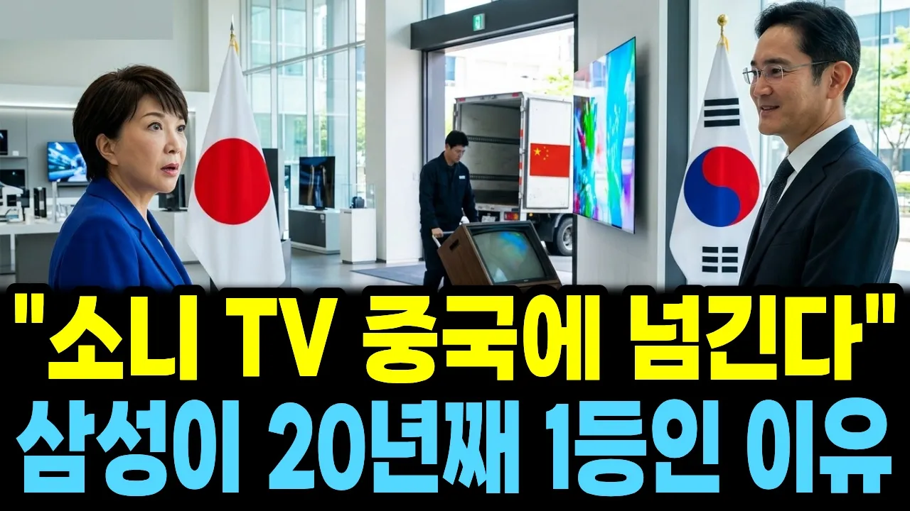

# "소니 TV 중국에 넘긴다" 안방의 왕이던 일제 티브이가 무너지고 삼성이 20년째 1등인 진짜 이유

## 기본 정보
- **URL**: https://www.youtube.com/watch?v=ioz9urKhYNQ
- **채널명**: 경제의파장
- **구독자수**: 43
- **조회수**: 8,492
- **업로드일**: 2026-10-07
- **영상 길이**: 15:46
- **댓글 수**: 5
- **좋아요 수**: 19

## 썸네일

---

## 댓글 (추천순 TOP 10)

| 순위 | 좋아요 | 댓글 |
|------|--------|------|
| 1 | 0 | 1993년 매장 구석에서 먼지 쓰던 삼성 TV가 2006년 소니를 넘고 20년째 1등, 소니는 2026년 TV 사업을 중국 TCL에 넘기기로 했습니다. ▶ 이전 편: https://youtu.be/cjsIWd4fPY0 ▶ 다음 편: 삼성이 석 달 만에 번 돈 이야기 — 저녁 8시 여러분 집 첫 TV, 그리고 혼수로 고른 TV는 어느 회사 것이었나요? |
| 2 | 1 | 최강삼성❤❤❤❤❤❤ |
| 3 | 0 | 소니는 이제 주력이 게임산업임 플레이스테이션 |
| 4 | 0 | 판매금액은 일등일지 몰라도 점유율은 아니라던데 |
| 5 | 1 | AI 이미지 역겹네 |
