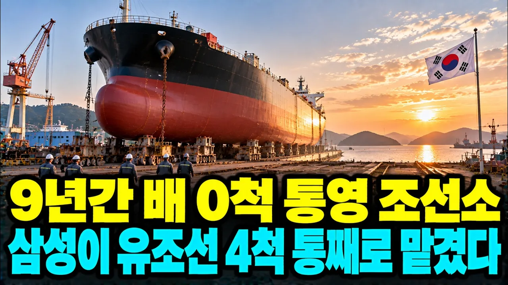

# "28개월 만에 다시 출근했습니다" 9년 동안 배 한 척 못 짓던 통영 조선소에 삼성이 유조선을 통째로 맡긴 진짜 이유

## 기본 정보
- **URL**: https://www.youtube.com/watch?v=1Zc8hlaDxLQ
- **채널명**: KR경제
- **구독자수**: 2,690
- **조회수**: 22,310
- **업로드일**: 2026-10-08
- **영상 길이**: 25:24
- **댓글 수**: 9
- **좋아요 수**: 272

## 썸네일

---

## 댓글 (추천순 TOP 10)

| 순위 | 좋아요 | 댓글 |
|------|--------|------|
| 1 | 4 | 키코사태는 기업 잘못이 아니라고 봅니다....정부 잘못임......... |
| 2 | 3 | 아름다운 삼성의 행보에 경의를 보냅니다. 통영은 이순신 장군때부터 해군본부였고 배를 건조했고 일제시대에 일본인이 들어와서 조선사업을 했고 내 조부도 그 기술을 익혀 대목장으로 지역 조선 기술자들을 키워낸 곳입니다.  60년대 한국이 찢어지게 가난하던 시절 원양배 만들어서 일본수출로 외화를 벌어들였고 70년대 지역면적당 국가에 내는 세금이 전국4위를 기록했었죠. 한국조선산업이 뼛속까지 이어진 지역입니다. 새 교육 바람에 자손들은 대도시로 떠났지만 지역에 남은 조선인들의 가슴에 조선은 가슴 속 용암같은 존재죠. 삼성이 한국의 혼을 또한번 살려낸겁니다. 삼성 사랑합니다 |
| 3 | 0 | 고맙습니다 |
| 4 | 2 | 대업~ 상생~도약~ |
| 5 | 3 | 제발좀 통영이 살아나길 화이팅입니다 |
| 6 | 1 | 철판은 삼성에서  공급 해주지  않을까 |
| 7 | 2 | 성동은 rg발급만 되면 수주는 계속 받을 예정임 주력인 115k탱커 가격이 예전에는 600억 이었지만 지금 900억 넘음 저가수주 절대 아닌데 rg발급을 안내줌 그리고 성동 문닫게 된건 문죄인이 정권잡고임 박근혜 탄핵당하고 문죄인 정권 잡더니 갑자기 다 끝난 이명박 측근에 돈줬다는 뉴스가 보도됨 한참 전 일이고 관련된 자들 처벌받았음에도 또 기사화 시키더니 적폐기업으로 만듬 그래서 수주받아놓은배도 취소되고 문 닫음 그 결과 전라도 해남에 대한조선이 급 부신함 같은 사이즈의 배를 주력으로 삼던 곳이라 성동에 배맡겼던선주사들이 대한으로 감 |
| 8 | 4 | 혹시성동조선 인가요 |
| 9 | 1 | 네 맞습니다. 간단 내용은 설명란을 보시면 됩니다. |
