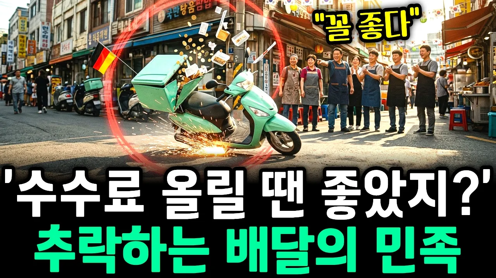

# "배민 꼴좋다" 소리 나오는 이유, 1위 독점의 대가를 치르는 중

## 기본 정보
- **URL**: https://www.youtube.com/watch?v=vgjclzZcR-Y
- **채널명**: 무궁화경제
- **구독자수**: 8,260
- **조회수**: 286,958
- **업로드일**: 2026-09-26
- **영상 길이**: 25:33
- **댓글 수**: 373
- **좋아요 수**: 1,990

## 썸네일

---

## 댓글 (추천순 TOP 10)

| 순위 | 좋아요 | 댓글 |
|------|--------|------|
| 1 | 126 | 배달민족탈퇴한지 2년째 불편하나 없어요 |
| 2 | 102 | 대체도 많고 이젠 매각 돼서 외국 기업인데다가 쟤네 때문에 소비자 물가가 뛰었는데 그냥 사라지는게 나음 |
| 3 | 3 | 쿠팡이츠도 미국꺼임. 악랄한건 둘다 마찬가지 |
| 4 | 5 | 맞습니다. 우리나라 외식비가 다른 선진국보다 높은이유는 저 배민 쿠팡 두 악마기업놈들때문입니다.  과도한 어플이용료 때문에 자영업자들은 음식값을 올릴수밖에없고 식재료또한 저가로 쓸수밖에없고 결국은 소비자들도 손해를 보는거죠... 내 개인적인 생각이지만 배민을 우버가 인수하는것보다 국민연금공단이나 국내 기업이 인수해서 소비자와 자영업자들이 같이 살수있었으면 얼마나 좋았을까하는 생각입니다. 어차피 세상이 바뀌었고 소비자들또한 익숙해진 앱을통해 모든 상품을 소비하니까요.. |
| 5 | 45 | 배달앱은 배달만 해라,음식파는 건 식당이 하고 그게 식당이 사는 길이다 |
| 6 | 73 | 라이더에게 지급하는 비용은 늘었는데.. 라이더는 돈을 더 못벌고 단가는 점점 내려가고 돈은  배민플러스 지사장만 않아서 돈버는 구조.? |
| 7 | 1 | 우리동네 지사장도 폐업 많이함 |
| 8 | 19 | 이게 존나 웃긴게 가계나 손님이나 배달비를 양측에서 6천원 가량 부담하고 있는데 정작 기사들한테는 멀티콜 2200원짜리, 심하면 천원짜리가 들어온다는거지. 장거리콜을 사람들이 싫어해서 거기에 금액을 더 올려준다해도 그걸 손님이 부담하게 해야지 양측에서 다 떼먹고 있는데 문제가 많지. 만원짜리팔면 배달비 3천원에 수수료 원가까지 더하고 나면 칠팔천원이 넘는 수준이라 답없는거지. 물론 만원짜리 하나 팔겠다고 장사하는건 아니겠지만 그만큼 떼가는게 많다보니 중국집 홀에서 먹는게 만원이라면 배달시키먼 만이천원 만삼천원에 팔게 되는거. 그래야만 이익이 남아서 운영이 되니까 |
| 9 | 80 | 배민은 망해야됨! |
| 10 | 10 | 쿠팡도 |
