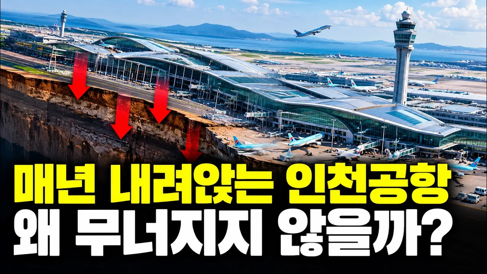

# 인천공항은 매년 가라앉고 있습니다...그런데 아무도 걱정하지 않는 이유

## 기본 정보
- **URL**: https://www.youtube.com/watch?v=azDh1DCTVaY
- **채널명**: 경제콜렉터
- **구독자수**: 3,080
- **조회수**: 85,324
- **업로드일**: 2026-09-22
- **영상 길이**: 25:25
- **댓글 수**: 19
- **좋아요 수**: 1,432

## 썸네일

---

## 댓글 (추천순 TOP 10)

| 순위 | 좋아요 | 댓글 |
|------|--------|------|
| 1 | 7 | 많이   배우고  좋은  정보  감사합니다 |
| 2 | 3 | Sand Pile 공법이라고, 바닷가 갯벌, 목포/영암공장, 포항 등 바닷가에 모래파일을 박고, 공장을 지었다 잘~ 모름, 밀가루반죽판 위에 도마를 놓고, 눌러 보면 모를까~? |
| 3 | 1 | 광양제철도 샌드파일공법으로 했지요 😂 |
| 4 | 7 | 땅의침하는 인간의지혜로 해결할한다지만 매년 상승폭이 커지는 해수면상승과 예측불가한 기후변화는 인간능력밖이다. 유감스럽게도 우리서해안은 간만의차이가 심하다. 운신폭이 좁은 작은땅이지만 한곳에 몰빵하는건 절대 현명한 방법이 아니다. 분산하고 대체물을 찾아야한다. |
| 5 | 2 | 예:  이 세상 공항은 매번 다양한 활주로 변질이~, 어느 지반이  갑짜기 일부 아래로 들어간다던지, 금이 간다던지, 여러가지 일들이 다반사지요. 이걸 가지고 님은 시비를 걸고있는셈입니다. 해외에서, |
| 6 | 1 | 다른대로 옮기면되지.  걱정 은. 무슨걱정 이냐? |
| 7 | 5 | 울륭공항 잘하네 ~~ |
| 8 | 0 | 전문 건설업 하는 분이 들어야 하네요... |
| 9 | 0 | 더 잘알고 있어요😂 |
| 10 | 1 | 자연현상을 재난화시키는 유튜빙... |
