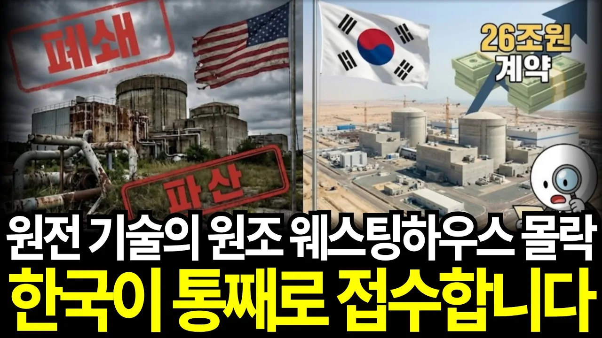

# 원전의 원조 웨스팅하우스의 몰락, 한국이 전 세계 원전 시장 통째로 접수합니다

## 기본 정보
- **URL**: https://www.youtube.com/watch?v=HjlK8cgwmtQ
- **채널명**: 간단경제한스푼
- **구독자수**: 12만
- **조회수**: 83,814
- **업로드일**: 2026-02-01
- **영상 길이**: 24:25
- **댓글 수**: 206
- **좋아요 수**: 4,604

## 썸네일

---

## 댓글 (추천순 TOP 10)

| 순위 | 좋아요 | 댓글 |
|------|--------|------|
| 1 | 56 | 이익에 10퍼도 아니고 매출에10퍼면 그냥 적자임~레시피가 특허임?! 이건 강화도조약 아니냐? |
| 2 | 2 | 수주단가를 올리면 되지않을까요? |
| 3 | 32 | 굴욕적이다 관련자들  처드셨겠지 |
| 4 | 17 | 굴욕적인 것은 맞다. |
| 5 | 47 | 웨스팅 하우스 지금가격 50분의 1에 나왔을때 인수 했으면  그 기회 놓쳐 평생 하청업체 되었구나 쯧쯧 쯧 |
| 6 | 0 | 2018년 50억불이면 살 수 있는 기회를 문재인때라 날려 버림 |
| 7 | 1 | 두빌화이팅🎉🎉🎉🎉🎉 |
| 8 | 0 | 시청해주셔서 감사합니다! |
| 9 | 2 | 이런  굴욕적  계약은  안하는게   낫다!    뒤로  챙겼을 법한  계약으로   파기해야한다고  생각한다 |
| 10 | 2 | 웨스팅 하우스 계약 관련 특검이 필요하다고 본다. |
