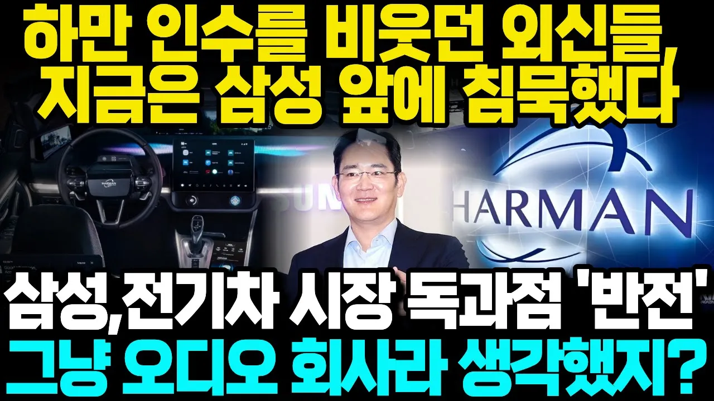

# 하만 인수를 비웃던 외신들, 지금은 삼성 앞에 모두 침묵했다! 삼성 전기차 시장 독과점하는 놀라운 상황! 극적 반전, 그냥 오디오 회사라 생각했지?

## 기본 정보
- **URL**: https://www.youtube.com/watch?v=BiOHUdktL30
- **채널명**: 위대한스토리
- **구독자수**: 2만
- **조회수**: 314,876
- **업로드일**: 2025-10-21
- **영상 길이**: 27:07
- **댓글 수**: 255
- **좋아요 수**: 5,645

## 썸네일

---

## 댓글 (추천순 TOP 10)

| 순위 | 좋아요 | 댓글 |
|------|--------|------|
| 1 | 84 | 이재용 회장은 경영능력도 훌륭하지만, 인품이 훌륭해서 좋더라. 세계로 뻣어나가라 삼성!!! |
| 2 | 190 | 흥해라 삼성! 대한민국의 큰 아들같은 든든한 기업! |
| 3 | 58 | 진짜 작은나라에서 태어난 글로벌기업 삼성 대단합니다. |
| 4 | 21 | 하만은 스피커회사 이기도하고 자동차 배선설비 회사도함 |
| 5 | 19 | 그 누구도 못 따라오게 1위업체로만  똘똘 뭉치는 그룹.. 삼성   화이팅 |
| 6 | 227 | 우리나라 쓰레기 언론 기레기들은 당시에 '부잣집아들 이재용이  사업은 할줄모르고 고급취미에 회사돈 9조원을 썼다. 경영능력이 인정되지않는다.' 라며 비꼬고 칼을 들이대며 협박해서 돈띁어 먹을 궁리를했음. 2016년 산더미같은 거짓말을 쏱아낸 그 언론과 기레기들임. 잊지말자. 나라가 살려면 언론을 정화해야함😊🎉❤  대한민국만세! 하려면! |
| 7 | 10 | 하만카돈 스피커로 음악을 들었을때 뭐 이런기업이있지ᆢ천상의 느낌이였습니다. 삼성의결단 대단했고 지금에보면 미래를 내다본 미래였습니다. |
| 8 | 1 | 맞습니다. 정확한 지적입니다. |
| 9 | 1 | 이제 삼성이 주주들을 위해 포스코와 HMM을 인수해줬으면 좋겠습니다 |
| 10 | 14 | 언론이 그렇겠나요? 삼성 그룸의 몇명만 구속시키고, 최고경영진 택갈이하면 죽창왕국처럼 다수의 농노와 빨치산들이 축제한다고 광기 부리던  대한민국의 홍위병 축제. 신문화혁명 즉, 진시황제나 마오쩌둥, 시진핑식 인민재판 시기인데요. 아직 틈을 보고 있는 수백만의 도적떼가 더 키워서 잡아 먹는다고 이를 갈고 있겠디. 그 도적떼가 죽었거나 사라지지 않았지. 중공 코로나 위세가 줄어드니 국내 동조세력이 잠시 숨고르기 중일 겁니다. 지금은 글로벌 공산무리와 악의 세력 소탕 중이라 권력 돈 군대 간첩단 공산화 무기를 탑재하고도 본진이 궤멸 중이라.... |
