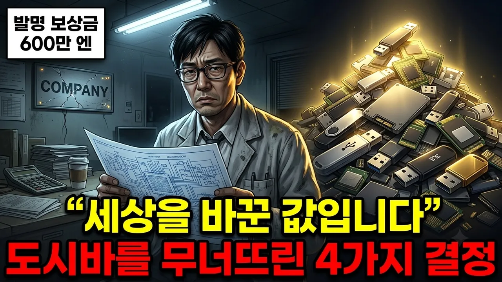

# 74년 만에 상장 폐지된 도시바, 세계 1위 반도체 제국이 무너진 진짜 이유

## 기본 정보
- **URL**: https://www.youtube.com/watch?v=gFoVcxOF5yI
- **채널명**: 세계사뒷문
- **구독자수**: 1만
- **조회수**: 4,756
- **업로드일**: 2026-08-07
- **영상 길이**: 28:39
- **댓글 수**: 6
- **좋아요 수**: 70

## 썸네일

---

## 댓글 (추천순 TOP 10)

| 순위 | 좋아요 | 댓글 |
|------|--------|------|
| 1 | 0 | 웨스팅하우스와는 노예계약인데. . |
| 2 | 3 | 우리나라도 마찬가지일 듯...기술자나 프로그래머에 대한 대우도 열악하고,외노자들이나 데려오고,있지요. 세계화,다문화로 온갖 문제가 발생하고 있고,나라는 점점 가라앉고 있는 중... 이런데도 근본적인 문제 해결은 하지않고,문제가 생겨서 나라안이 시끄러워져야 비로소 그 부분만 땜질하는 주먹구구식 행정을 하고 있지요. |
| 3 | 0 | 인건비후려치겠다고그런거 |
