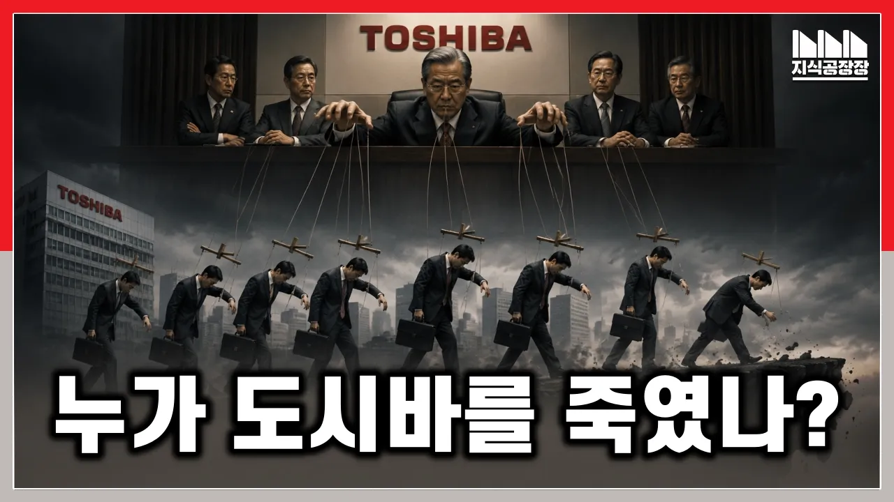

# 반도체 기술의 상징 도시바를 AI 시대에서 지워버린 치명적 실수란?

## 기본 정보
- **URL**: https://www.youtube.com/watch?v=V8p4_uzdxgs
- **채널명**: Jisik Manager's Factory
- **구독자수**: 7만
- **조회수**: 372,753
- **업로드일**: 2026-09-12
- **영상 길이**: 14:39
- **댓글 수**: 224
- **좋아요 수**: 1,726

## 썸네일

---

## 댓글 (추천순 TOP 10)

| 순위 | 좋아요 | 댓글 |
|------|--------|------|
| 1 | 30 | 도시바는 앞으로 부활할 수 있을 것이라고 생각하시나요, 아니면 이대로 갈 것이라 생각하시나요?  12:14 도시바 --> 도요타로 정정합니다. 다음부터는 검수에 더욱 신경쓰겠습니다.   ◆ 관련영상
 한국 기업의 히타치 인수? 일본은 왜 유난히 충격을 받았는가?
 https://www.youtube.com/watch?v=jPR9sI5ru2U
 
 기업, 브랜드 지식공장
 https://www.youtube.com/playlist?list=PL8oyliyuu5qoDpbFKX6TctXJWfY6bLM6A
 
 《돈, 역사의 지배자》 전자책 발매! 많은 성원 부탁드립니다!
 교보문고: https://ebook-product.kyobobook.co.kr/dig/epd/ebook/E000013190636
 알라딘: https://www.aladin.co.kr/shop/wproduct.aspx?start=short&ItemId=398721833
 
 ◆ 지식공장장의 네이버 프리미엄
 https://contents.premium.naver.com/jisikmanager/jisik
 
 ◆ 취미, 문화 채널
 https://www.youtube.com/@%EC%A7%80%EC%8B%9D%EA%B3%B5%EC%9E%A5%EC%9E%A5/featured |
| 2 | 5 | 도시바가 저력있는 기업임은 부정하지 않겠지만.. 부활을 위해선 가진게있어야할텐데 그럴민한 (믿음직한) 동력원이있을까요? |
| 3 | 1 | 살아있겠지요. 큰시장은 아니고 특수시장 |
| 4 | 0 | 여기서 빠진 핵심내용이 있는데. 1987년 도시바는 기밀유출 사건으로 미국의 표적으로 지정됨 소련에 공작기계를 팔아넘긴 죄로 미국의 제 1순위 표적이 된게 스노우볼이 구른거임 미국시장 수출길이 3년간 막혔고←  무엇보다도 미.일 반도체 협력과 맞물려 도시바의 핵심 먹거리였던 D램과 반도체 사업에서 미국의 강한 견제와 규제를 받음. 이 틈을 타 삼성전자와 하이닉스(당시 현대전자/LG반도체)가 D램 시장을 맹렬이 치고 올라올 수 있는 판이 깔림.  여기서 또 알아야할것이 일본의 샤프 소니등이 어떻게 성장하였냐 임. 진공관→트랜지스터→반도체 라는 테크트리에서 미국의 특허 트랜지스터기술을 헐값에 배운 소니가 라디오 샤프가 계산기로 미국 전역을 휩쓸고 그 제조기술을 바탕으로 D랩 시장에서 인텔을 개박살냄  1985년 인텔이 수율에 밀려 D램 사업을 철수함.  인텔이 D램 철수를 선언한 1985년 바로 그해 9월,  뉴욕 플라자 호텔에서 미·일·독·영·프 5개국 재무장관이 모여 플라자 합의(Plaza Accord)를 체결합니다.  이런상황에서 도시바는 눈치도없이 소련에 기술을 유출하였고.... 내부고발로 1987년에 드러나자  일본의 반도체 굴기 자체가 미국에 의해 거부당하고 도태되는 계기가됨   도시바 기계 사건(1987년)은 단순한 기업의 비리가 아니라, 미국이 일본의 '기술 패권'에 법적·안보적 형벌을 내려 싹을 자른 결정적 분기점 |
| 5 | 0 | 분식회계 전력이 있어서 재상장은 힘들거라 봅니다 |
| 6 | 0 | 이미   부활  했음     ~~~     앞으로가   문제임      ~~~ 기존 경영진의   "기술자  경시 사상"만 없어지면 일본  1위   기업이   될   것입니다.       이   분야   삼성전자도    못   따라  갈   것으로  판단됩니다. |
| 7 | 0 | hdd가 없어질건 아니라 |
| 8 | 123 | 도시바의 사례를 보면 알 수 있는 것들 -영원한 승자는 없다. -기업은 언제나 망할 수 있는 조직이다. -지휘관이 무능하면 그 밑의 부하들은 다 죽는다. |
| 9 | 7 | 도시바는 소련에 군사기술 팔아먹고 미국한테 걸린게 너무큼 이거로 일본의 반도체 산업자체가 모조리 거부당해버리고 제재 맞아버렸으니... "경제.산업의 경쟁자" 에서 "국가.안보의 배신자" 가 되버렸으니 할 말이 없던거지. 일본의 통상성이 자국기업을 보호할 명분마저 완전히 상실하게 만든 |
| 10 | 0 | 현재   도시바(1대주주)   자회사  키오시아는   과거   도시바  모든 계열사 전체의 10배 이상 최대  규모의 회사가  되었습니다.     한때   일본  전체  시가총액 1위가  되었습니다.  아마   내년이면    다시   일본 1위로  올라설 가능성이  높습니다.    적어도  일본의 상징     " 도요타"   보다   더   큰 회사로   갈  것은   분명합니다.  너무   쉽게    그릇된   평가는  말아 주세요.        도시바  경영진의 문제이지 도시바의 문제는 아닙니다. |
