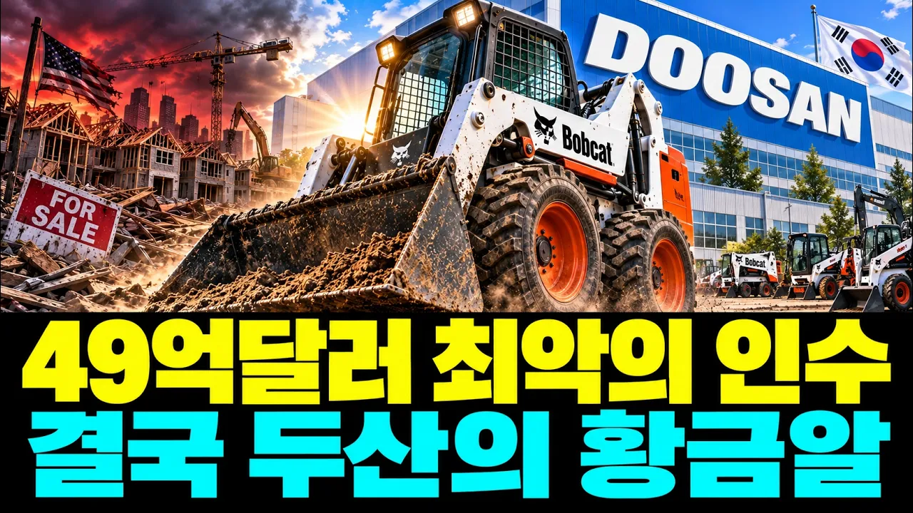

# “최악의 인수가 최고의 자산이 됐다”… 시장 붕괴 직전 미국 회사를 인수한 두산, 어떻게 밥캣을 세계적 기계기업으로 키웠나

## 기본 정보
- **URL**: https://www.youtube.com/watch?v=fUFQuyv7ZzY
- **채널명**: NSH24JP
- **구독자수**: 3,280
- **조회수**: 198,470
- **업로드일**: 2026-09-23
- **영상 길이**: 26:11
- **댓글 수**: 24
- **좋아요 수**: 1,539

## 썸네일

---

## 댓글 (추천순 TOP 10)

| 순위 | 좋아요 | 댓글 |
|------|--------|------|
| 1 | 15 | 지루하다또하고!!짜증난다.~햇던소리 또 또 또 |
| 2 | 0 | 밥켓 인수과장 아주 좋은 정보, 감사합니다 |
| 3 | 7 | 징글 징글하다.  이렇게 반복으로 시간을 늘려야 했니? |
| 4 | 11 | 원고 정리좀 잘 합시다.  지루해서 나감. |
| 5 | 6 | AI가 망가졌네..관리자는 관리를 포기했나...정리는 관리자가 해야죠 |
| 6 | 6 | 질질  시간 좀 끌지 마라 !!!  징글징글 하다 |
| 7 | 9 | 고작 한해 1조를 남기려고 수십 수백조 미래가치를  지닌 알짜를  판것이 옳은거야?  로더를 아무리 잘만들어도  파리는것은 한계가 있고  더이상 어떤 성장을 기대하나  그들이 판것을 봐라  그룹을 단일회사로 만드는 능력 |
| 8 | 0 | 어차피 팔수밖에 없어서 판 것입니다. 물론 두산건설기계 쪽을 판 것은 실망이지만요. 방향은 무너질 대기업 중에 가장 잘 잡았습니다. 발전소, 밥캣 그리고 반도체 패키징. 동부그룹도 건설 정리하는 중에 반도체. |
| 9 | 5 | 원래 좋은 회사였지.  비싸게 샀지.  대박은 아니지.    그 돈이면  SK하이닉스도 살 수 있었지. |
| 10 | 0 | 인수 직후 금융위기까지 터졌다면 당시에는 정말 최악의 선택처럼 보였을 것 같네요. 그런데 기업 인수는 결국 사는 순간의 가격보다 그 회사를 이후에 어떻게 운영하고 키우느냐가 더 중요하다는 걸 보여주는 사례 같습니다. 실패로 보이던 선택이 시간이 지나 핵심 자산이 됐다는 과정이 인상적이네요. |
