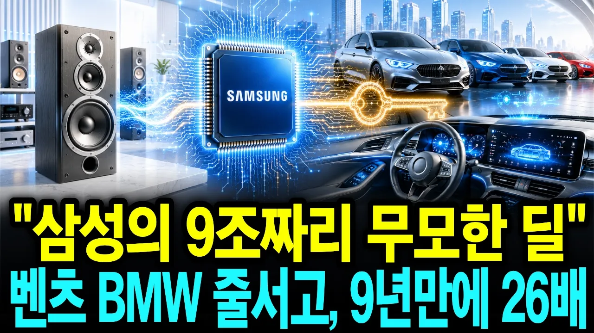

# 삼성이 스피커 회사 '하만'을 9조에 산 진짜 이유! 전기차 시대에 다시 주목받는다

## 기본 정보
- **URL**: https://www.youtube.com/watch?v=7yOJFLNxf2c
- **채널명**: 경제화이팅
- **구독자수**: 4만
- **조회수**: 28,500
- **업로드일**: 2026-07-01
- **영상 길이**: 20:39
- **댓글 수**: 5
- **좋아요 수**: 623

## 썸네일

---

## 댓글 (추천순 TOP 10)

| 순위 | 좋아요 | 댓글 |
|------|--------|------|
| 1 | 4 | 안녕하세요, 경제화이팅입니다.
 
 2016년, 삼성이 9조 원을 들여 '스피커 회사' 하만을 샀을 때 시장에는 조롱이 쏟아졌습니다. 자동차도 접었던 삼성이 무리한 것 아니냐고요. 실제로 인수 첫해 영업이익은 90% 넘게 폭락하며, 이 승부는 실패처럼 보였습니다.
 
 하지만 삼성이 산 건 스피커가 아니었습니다. 벤츠와 BMW의 문을 여는 열쇠였죠. 조롱을 견딘 9년 뒤, 그 무모하다던 승부는 이제 해마다 1조 원 넘는 이익을 벌어오는 무기가 됐습니다.
 
 갤럭시 노트7으로 회사가 흔들리던 위기의 한복판에서, 몸을 사리기는커녕 창사 이래 가장 큰 승부를 던진 삼성. 여러분은 이 담대한 결단을 어떻게 보셨나요? 위기 앞에서 오히려 크게 베팅한 삼성의 선택, 여러분의 생각을 댓글로 한 줄만 남겨주세요. 하나하나 소중히 읽겠습니다.
 
 감사합니다.
 경제화이팅 드림. |
| 2 | 2 | 20년 전 삼성자동차의 아픔부터 현재 하만의 전장 역대 최고 실적까지, 한 편의 영화처럼 스토리를 유기적으로 연결해 주셔서 정말 이해가 잘 되었습니다. 남들이 비웃을 때 미래를 산 삼성의 뚝심도 대단하지만, 이걸 정확한 팩트와 매끄러운 연출로 전달해 주신 채널 운영자님의 실력이 더 놀랍네요. 구독하고 다음 영상도 기대하겠습니다! |
| 3 | 1 | 이렇게 꼼꼼히 봐주시고 좋은 말씀까지 남겨주셔서 감사합니다. 삼성자동차의 아픔이 하만으로 이어지는 그 20년을 최대한 사실 그대로, 하지만 지루하지 않게 담으려 했는데 그 마음이 전해진 것 같아 기쁩니다. 저도 구독 갈게요! |
| 4 | 0 | 이 아재들 했던 말 또 하고 또 하고 어디서 배웠는지 |
| 5 | 4 | 삼성 최고 이재용 최고!!! |
