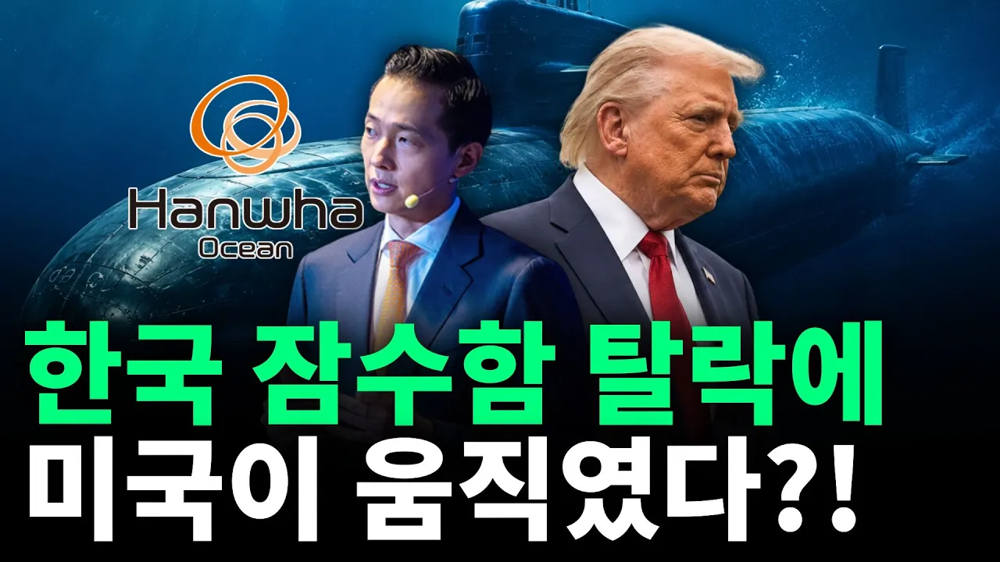

# 60조 놓쳤더니 1600조가 굴러왔다? 미국이 한국 조선업에 다급히 SOS 친 이유

## 기본 정보
- **URL**: https://www.youtube.com/watch?v=V1LP6csv7Jk
- **채널명**: 원빅월드쇼 | One Big World Show | 1BWS
- **구독자수**: 88만
- **조회수**: 456,347
- **업로드일**: 2026-08-24
- **영상 길이**: 14:54
- **댓글 수**: 636
- **좋아요 수**: 8,702

## 썸네일

---

## 댓글 (추천순 TOP 10)

| 순위 | 좋아요 | 댓글 |
|------|--------|------|
| 1 | 135 | 🙌🏻 원빅월드쇼 구독자 여러분! 오늘 영상에서는 캐나다 잠수함 수주 탈락 직후 터진 미국의 다급한 SOS와, 1600조 원 규모의 태평양 해양 패권 전쟁 속 K-조선업의 결정적 역할을 다뤄봤습니다. 미국이 법령까지 우회하며 한국 조선소에 손을 내민 진짜 속내와, 앞으로 K-조선이 마주할 거대한 기회와 리스크에 대해 여러분은 어떻게 생각하시나요? 👇🏻 자유롭게 댓글로 의견을 나눠주세요! 🎉 더불어, 원빅월드쇼가 여러분의 뜨거운 응원에 힘입어 어느덧 '100만 구독자 달성'이라는 대망의 목표를 향해 달려가고 있습니다! 100만 고지를 밟게 되면 저희가 꼭 보여드렸으면 하는 '특별한 100만 공약'이나, 평소 다뤄줬으면 했던 기획 아이디어가 있다면 언제든 이 댓글에 '대댓글'로 남겨주세요. 여러분의 기발하고 톡톡 튀는 의견을 기다리고 있겠습니다! 📣 앞으로도 세상을 꿰뚫어 보는 빠르고 유익한 인사이트를 절대 놓치고 싶지 않으시다면? 🔔 다음 영상을 위해 지금 바로 구독과 좋아요, 알림 설정까지 꾹! 부탁드립니다! |
| 2 | 0 | 미국 유력 정치인과 한미협력에 대한 인터뷰 해주세요 |
| 3 | 0 | 네이도가 뭐야 나토! |
| 4 | 0 | 그러면 뭐하나요? 대한민국 기득권이 親中/從中인데? 親中/從中 국힘당에 親中/從中 민주당에 親中/從中 사법부인데? 미국은 이 문제를 어떻게 다룰려고 하는지? 난 도저히 이해가 안갑니다. 아무리 미국 제조업 재건을 위해 한국이 필요하다고 해도 대한민국 정권 자체를 親中/從中화 시킬 필요까지는 없었을 터인데요? 반만년이라고 하는 기원전 2,333년 건국된 고조선부터 지금까지 한민족은 거의 5천년이나 中國에 대한 反中 정책을 통하여 한민족의 아이덴티티(정체성)을 지켜왔습니다. 그런데 이제와서 中國에 종속시키려고 아둥바둥 대는 미국 국무부의 움직임에 대해서는 비판을 할 수 밖에 없습니다. |
| 5 | 183 | 타일러는 진짜 천재가 맞다 이런 어려운 내용을 알기 쉽게 설명을 해주는데 그것도 한국어로 설명을 해준다??? 천재 맞음 |
| 6 | 4 | 캐나다가 독일을 선택한 또다른 이유는 현재 캐나다 정권이 중공에 매수되었고 반미친중 노선이라서 |
| 7 | 2 | 미친놈임ㄷㄷㄷ |
| 8 | 0 | 천재가 아니라 너같은 놈들이 손가락을 놀고 있으니까  한국이 도태 되는거야...알고있는데? 정보를 처음 알았다고?  그게 원인이야 |
| 9 | 166 | 저는 타일러 님이 대한민국의 명예 외교관이라고 생각해요! 🇰🇷 대한민국을 진심으로 아끼고 우리나라의 매력을 세계에 알리는 모습을 볼 때마다 정말 멋지고 감사하다는 생각이 듭니다. 언젠가 정말 대한민국을 대표하는 외교관이 되어주셨으면 좋겠어요. 🫶❤️ |
| 10 | 0 | 🤗🤗🤗🤗🤗 |
