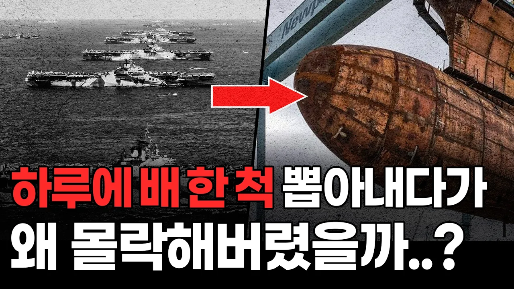

# 막강했던 미국 조선업은 왜 붕괴됐을까?

## 기본 정보
- **URL**: https://www.youtube.com/watch?v=N-qS_EabnZ4
- **채널명**: 지식한잔
- **구독자수**: 69만
- **조회수**: 112,597
- **업로드일**: 2025-11-30
- **영상 길이**: 10:11
- **댓글 수**: 306
- **좋아요 수**: 2,432

## 썸네일

---

## 댓글 (추천순 TOP 10)

| 순위 | 좋아요 | 댓글 |
|------|--------|------|
| 1 | 156 | 미국하면 해군인데 조선업이 이러면... 이래서 마스가란 구호가 나왔군요... |
| 2 | 12 | 지들 생명줄임. |
| 3 | 6 | 사실상 우리가 갑인 정말 이례적인 순간이죠 ㅋㅋㅋㅋㅋㅋㅋㅋㅋㅋㅋㅋㅋㅋㅋ |
| 4 | 6 | 미국이 일본 조선업은 키워주면서 지들은 말아 먹는 놀라운 업적을 성공했습니다. |
| 5 | 336 | 대신 달러랑 오일, 3차산업들 낭낭하게 챙겨드셨잖아~ |
| 6 | 2 | 응 역시 대한민국 드립이 최고야 ㅎㅎ |
| 7 | 0 | This is the sad truth |
| 8 | 0 | 오일은 푸틴한테 진거나 진배없지 ㅋㅋ |
| 9 | 8 | 금융허브라서 굳이 조선업 안키워도 돈이굴러들어옴 ㅋㅋ |
| 10 | 14 | 어 중국이 희토류 잠가라 하자마자 무릎 꿇었어 |
