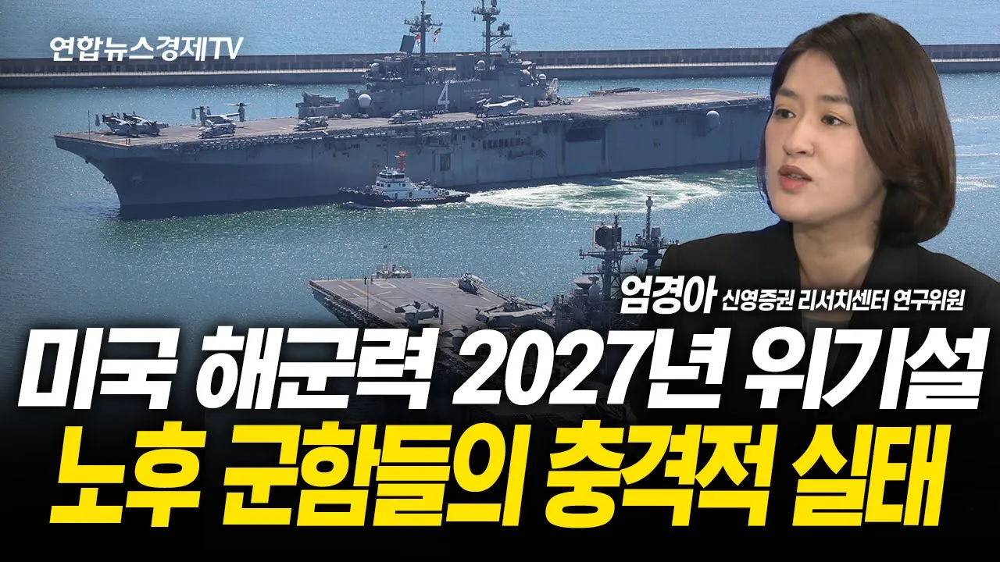

# 미국 핵잠수함 10년째 정비 지연...트럼프가 한국 조선업에 매달리는 이유 (엄경아 연구위원) | 250813 경제훈풍

## 기본 정보
- **URL**: https://www.youtube.com/watch?v=1hmIV64u8dE
- **채널명**: 연합뉴스경제TV
- **구독자수**: 108만
- **조회수**: 53,156
- **업로드일**: 2025-08-13
- **영상 길이**: 21:45
- **댓글 수**: 100
- **좋아요 수**: 867

## 썸네일

---

## 댓글 (추천순 TOP 10)

| 순위 | 좋아요 | 댓글 |
|------|--------|------|
| 1 | 7 | 조선업에 명쾌한 해석을 해주시고 계신는 엄경아 님을 존경합니다.  해박한 지식과 세계 정세에 대한 통찰력...  조선업에 대해서는 최고의 해설가 입니다. |
| 2 | 0 | 염경아 연구위원님, 좋은 말씀 감사합니다. 요즘 바쁘시군요. 늘 건강 조심하세요. |
| 3 | 7 | 지들 상황이저런데 ,뭔 방위비증액 ? 조선업 투자해주면 업고 다녀야지 |
| 4 | 9 | 지금의 트럼프는 대만을 중국에 넘겨 줄 것 같은 느낌. |
| 5 | 0 | 미국핵잠수함 지통실은 미국보안구역인데 한국인수리직원이 접근불가할걸요 |
| 6 | 1 | 노하우 씨스템 다 카피하고  버리면 어찌해요 |
| 7 | 4 | 그대신 비싸게, 아주 비싸게... |
| 8 | 0 | 아버지한테 ㅋㅋㅋㅋㅋㅋㅋ |
| 9 | 0 | ​ @랑야-p5z 리박견은 애비가 미국조주빈 |
| 10 | 0 | 3년간 400% 수익율이지만 18:59 내년까지 시종일관 앞으로도 밀고 가겠습니다. |
