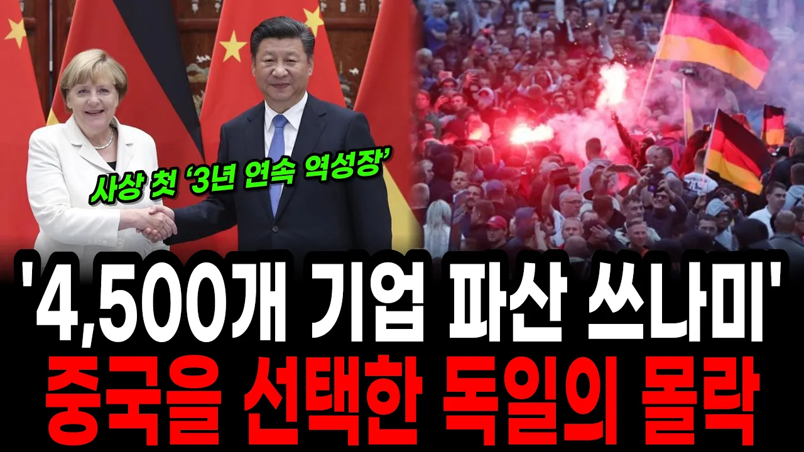

# 중국에 영혼을 판 대가? 독일 제조업의 충격적인 몰락

## 기본 정보
- **URL**: https://www.youtube.com/watch?v=-pY15JTfvOY
- **채널명**: 똑똑한 경제학
- **구독자수**: 6만
- **조회수**: 286,004
- **업로드일**: 2026-07-14
- **영상 길이**: 23:41
- **댓글 수**: 541
- **좋아요 수**: 6,107

## 썸네일

---

## 댓글 (추천순 TOP 10)

| 순위 | 좋아요 | 댓글 |
|------|--------|------|
| 1 | 303 | 중국이 큰 시장이긴 하지만 중국 밖에도 큰 시장이 있다는 것. 중국에 목숨 걸어서는 안 된다. |
| 2 | 13 | 사드때 어느정권이었는지 아시죠? 지금 민주당은 다시 친중으로 가고있습니다 걱정됩니다 |
| 3 | 7 |  @보고르bj  다시 친중이라니? 민주당은 늘 친중이었는데 |
| 4 | 0 | ​ @보고르bj  중국 전승절 사열대에 박근혜가 올라간 건 알고 있니? |
| 5 | 2 | ​ @보고르bj 문석열로 보수가 괴멸했는데 어쩌라고요? |
| 6 | 1 | ​ @보고르bj 지랄 엠병하네.ㅋㅋ명박근혜 시절이 진정한 친중정권이었지. 문재인때는 중국쪽에서 사드문제로 손절쳐서 친중하고 싶어도 불가능했어. |
| 7 | 1 | ​ @냠냠-b5p 이명박근혜 정권에서는 대등한 국가로써 중국과 시진핑과 대통령의 만남과 수교였고 대중문제명은 굴욕적인 수교를 한거지. |
| 8 | 2 | 중국하고 엮이면 절대 않됩니다 ~ 시장 엮이면 않됩니다 |
| 9 | 1 | 물건만 수출하는건 괜찮은데 모든 비밀제조방법을 다 넘겨줬으니 그게 문제였던것였죠 |
| 10 | 74 | 중국은 파트너로 갈생각 전혀 없음 오직 자기들이 독식 할려고만 하기 때문에 협력대상이 아니다 |
