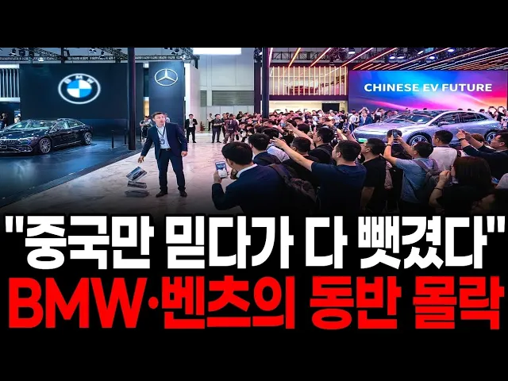

# "BMW·벤츠가 어쩌다가…" 중국만 믿었던 독일차가 안방까지 내주고 몰락하는 진짜 이유

## 기본 정보
- **URL**: https://www.youtube.com/watch?v=FVDy1ygHQyA
- **채널명**: 지식발굴단
- **구독자수**: 3만
- **조회수**: 35,083
- **업로드일**: 2026-08-13
- **영상 길이**: 29:24
- **댓글 수**: 67
- **좋아요 수**: 822

## 썸네일

---

## 댓글 (추천순 TOP 10)

| 순위 | 좋아요 | 댓글 |
|------|--------|------|
| 1 | 12 | 믿을놈를 믿어야지.. |
| 2 | 16 | 중공믿다 다빼겼다 그건 메르켈때 이미시작된 것이다 |
| 3 | 27 | 중국은 믿어면 큰일납니다 중국은 한국앞서는기술을 빼갈생각 뿐입니다 중국은 기술 빼갈 간첩들이 너무많습니다 중국은 한국을 천년을 먹을여고 하고있습니다 바뀐것이 하나도 없습니다 중국은 한국에게 조공을 받고 살여고합니다 한국앞서는기술을 빼가고나면 일차적으로 한국기업 덤핑으로 다 죽이고 나면 제값받고 세계 독점하겠다고 한국앞서는기술을 다 빼갈때까지만 가지고 놀다가 한국은 폐기처분해서 세계 최빈국으로 만들어서 북한처럼 굶어죽는 꼴을보게 될것입니다 독일이 중국에 당해서 망하고 있습니다 전세계가 중국에 당하면 분명히 망할것입니다 |
| 4 | 1 | 동감! |
| 5 | 0 | 그런데도 ᆢ 울나라 썩은 정치인들이 친중짓거리하면서   기술도둑질하는 간첩들 처벌도 못하게  간첩법 만드는것두 반대하고 있어요. 기술빼간 놈을 잡고도 간첩법이 없어서 그냥 풀어줬데요. |
| 6 | 0 | 아이고 그런 말이 아닌데.. 말귀를 못 알아먹는구만 |
| 7 | 2 | 이런 사람 조심! 앞에서 욕하고 뒤에서 듕국산 좋아함. 대중버스도 중국산인데 이용 안하려나? ㅎㅎㅎ |
| 8 | 1 | 내구성은 안따지네 겉은 멀쩡해 보여도 몇년뒤엔 고장나기 시작 |
| 9 | 13 | 안사요 |
| 10 | 8 | 전기차는 절대 주류가 될 수 없다. 태생적인 불리한 측면이 많음. |
