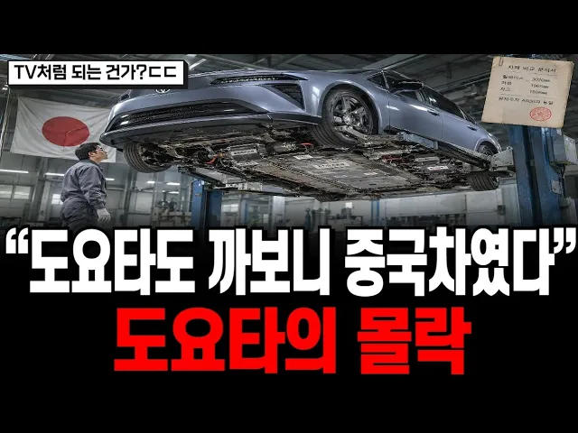

# “도요타도 속은 중국차였다” 상하이 엔지니어가 설계하는 렉서스, 일본 도요타의 몰락, 그 내막

## 기본 정보
- **URL**: https://www.youtube.com/watch?v=1Lsa5l6iRvU
- **채널명**: 지식발굴단
- **구독자수**: 3만
- **조회수**: 152,566
- **업로드일**: 2026-07-23
- **영상 길이**: 25:00
- **댓글 수**: 282
- **좋아요 수**: 3,158

## 썸네일

---

## 댓글 (추천순 TOP 10)

| 순위 | 좋아요 | 댓글 |
|------|--------|------|
| 1 | 110 | 애플에서 기술 제공해줘, 일본에서 설계도 가져다 받쳐. 참 중국 대단하다 |
| 2 | 4 | 사실상 가장 친중짓을 하는게 미국과 일본 이라고 봐야죠. |
| 3 | 1 | ​ @roskfl-n6s  ??? : 셰셰 |
| 4 | 3 | ​ @roskfl-n6s  삼성이나 sk도 중국한테 빼준게 만만치않은데 영포티평균 |
| 5 | 2 | ​ @roskfl-n6s  (설날에 대통령이 중국어로 인사를 하며) |
| 6 | 2 |  @Wjdnfnf  누구 박그네 말하는거냐? 중공전승절에 가서 시진핑 옆에서 히히덕 거리면서 손흔든 걔? 그리고 국민의힘이 90년대 부터 중국공산당 하고 자매결연 맺고 있는 사이 라는건 알고있지? 중국몽 이란 말을 제일 처음 외친것도 김무성 이다. |
| 7 | 60 | 일본전기자동차=광저우 자동차 |
| 8 | 53 | 세상이 어떻게 변해가고 있는지 모르고 파업이나 하는 노조 걱정이다. |
| 9 | 5 | 노조는 회사 망할 때까지 파업하는게 목표다. |
| 10 | 28 | 중국이 무너져야 세계가 살아날 듯. 제조업은 필연적으로 필요하다. |
