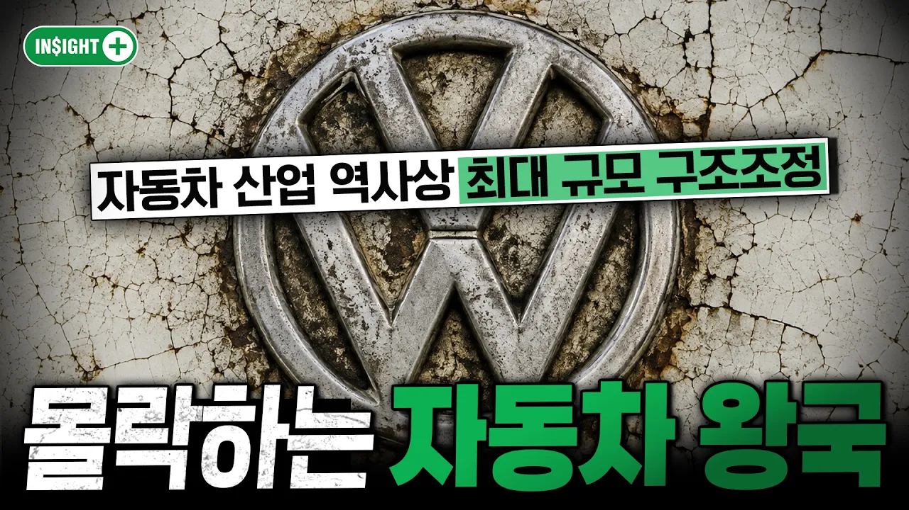

# 주가 70% 폭락ㅣ독일의 상징, 폭스바겐의 몰락ㅣ인사이트플러스

## 기본 정보
- **URL**: https://www.youtube.com/watch?v=BMUz1vVS6as
- **채널명**: Daishin TV
- **구독자수**: 26만
- **조회수**: 51,496
- **업로드일**: 2026-08-18
- **영상 길이**: 7:35
- **댓글 수**: 74
- **좋아요 수**: 338

## 썸네일

---

## 댓글 (추천순 TOP 10)

| 순위 | 좋아요 | 댓글 |
|------|--------|------|
| 1 | 19 | 중국한테 자동차 기술을.넘긴게 독일 폭스바겐... 엔진만 지키면 된다 생각했는데 전기차가 나와버림 |
| 2 | 18 | 중국 의존도가 너무 높았음 |
| 3 | 70 | 이쯤되면 사드보복으로 30%가 넘는 중국시장에서 진즉에 발뺀 현기차가 승리자네 |
| 4 | 11 | "위기를 기회로" |
| 5 | 5 | ㄹㅇ 새옹지마란 말이 딱 맞아떨어짐 ㅋㅋ |
| 6 | 0 | 솔직히 중국 브랜드 미국 시장에 진출 못한 게 다행인 거임 중국 시장에서 순위 밀린 것보다 아마 중국 브랜드 미국에 들어왔으면 현대 바로 치킨게임 시작일 듯 |
| 7 | 3 | 잘나가던 시장에서 나온게 아니라 다른 브랜드에 밀린거 아닌가 |
| 8 | 0 | ​ @주말노숙자  애초에 현기 중국시장 철수한적 자체가 없음 당장 최근에 중국 전략 전용 신차 따로 내놓는거 보면 나갈생각 없음 |
| 9 | 2 | 중국에서 현대 철수 안함 |
| 10 | 0 | 지금은 현기차 위기임 한국에 중국 차 엄청 많이 들어왔음. 테슬라도 현기차 점유율 계속 깎아 먹고 있고 |
