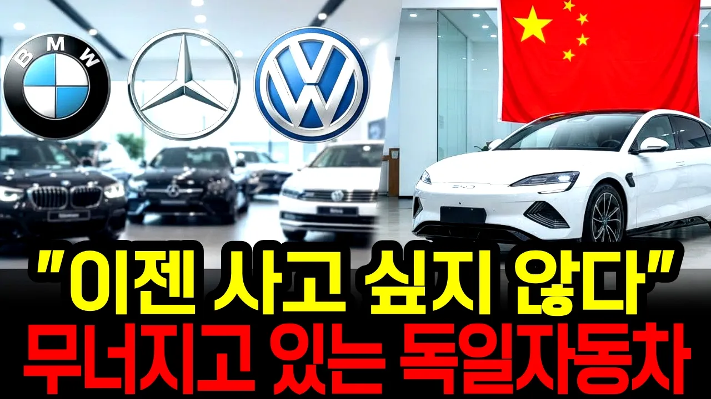

# 중국이 삼킨 게 아니었다, 독일차 몰락, 그럼 한국은?

## 기본 정보
- **URL**: https://www.youtube.com/watch?v=DDltr32ZfGM
- **채널명**: 한번쯤궁금했던이야기
- **구독자수**: 2만
- **조회수**: 19,066
- **업로드일**: 2026-08-29
- **영상 길이**: 15:14
- **댓글 수**: 30
- **좋아요 수**: 145

## 썸네일

---

## 댓글 (추천순 TOP 10)

| 순위 | 좋아요 | 댓글 |
|------|--------|------|
| 1 | 4 | 중국 묻으면 프리미엄은 다 사라진다 |
| 2 | 5 | 예전과 다르게 남이 뭔차를 타든 성공을 했든말든 관심이 많이 줄었습니다. |
| 3 | 5 | 현기차 국내시장 비중이 작고 해외이주중이니, 현기차가 국내차라 생각하지들 마요. 노란봉투법이나 통과시킬때 국민들은 아무것도 안하고 가격 비싸다고만 징징됨 |
| 4 | 3 | 내가보기에 유럽에서 내연기관차 규제가 시작되니 회사판거지. 그렇게해서 전기차시대가 오고있는데 장작 가장 중요한 배터리도 중국산 ㅋㅋ |
| 5 | 2 | 이제 현기차 가격이 비싸서 독일차 사려구요. |
| 6 | 0 | 가격이 참....... |
| 7 | 2 | 요즘 사람들 누가 뭘 타든 아무 관심없음...90년대 같은 소리하고 있네 |
| 8 | 4 | 짱츠ㅋㅋㅋ |
| 9 | 1 | 테슬라가 큰일했네~~~ |
| 10 | 0 | 원래 중국이 개입하면 시발 다 끝장나는거야 |
