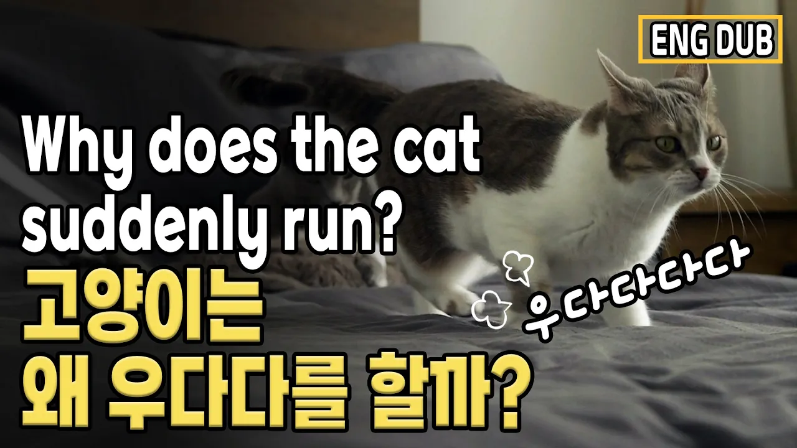

# 고양이는 왜 우다다를 할까? 건강에 문제는 없을까?

## 기본 정보
- **URL**: https://www.youtube.com/watch?v=XYYmYSK7ZxU
- **채널명**: My Pet Clinic - Dr. Yoon
- **구독자수**: 31만
- **조회수**: 50,300
- **업로드일**: 2024-05-20
- **영상 길이**: 6:09
- **댓글 수**: 69
- **좋아요 수**: 1,287

## 썸네일

---

## 댓글 (추천순 TOP 10)

| 순위 | 좋아요 | 댓글 |
|------|--------|------|
| 1 | 48 | 응가후에 우다다로 마무리 합니다❤ |
| 2 | 36 | 다묘가정의 우다다란 😂 |
| 3 | 21 | 윤샘님이 저희 지역에  계셨으면 참좋겠다는 생각을 해봅니다 어쩜 이리 훌륭하신지... 윤샘님 덕분에 늘 배우면서 고양이 잘키우고 있습니다 감사드립니다 ❤ |
| 4 | 2 | 우다다든 와다다든 우당탕이든 다 좋으니 건강히 행복하게 오래오래 함께하자❤사랑한다 울새끼❤❤❤❤❤❤❤❤❤ |
| 5 | 12 | 보리 누리는 밤만되면 가족들에게 압력을 줍니다. 얼른 방에 들어가 불꺼!  ㅋㅋ 그렇게 쫓기듯 들어가면 1분도 안되 우다다 시작 😂 그 소리를 들을때마다 웃음이 나오고 기뻐요.  근데 5분밖에 안가요. |
| 6 | 2 | 집사들 잘 시간어 애들은 우다다닥 ㅋㅋ 하고들 활동하다 놀고 그러다 어느새 잠들 자고 있더라고요 |
| 7 | 2 | 응가하고 우다다~~~~~~와서 스크래치 하는 우리 냥이 ㅋㅋ |
| 8 | 2 | 상가건물에 살고 있는데, 우리집 냥이들의 우다다다~~~ 덕분에, 아파트나 빌라등과 같은 공동거주지로의 이사는 아이들이 고양이별로 떠나는 그날까지 마음을 접었습니다. 정말 말도 안되는 속도와 높이감으로 전력질주합니다. |
| 9 | 3 | 하루에 한번씩 새벽에 이상한소리내면서 엄청뛰어다녀요 ㅋㅋ 가보면 꼬리부풀어있는데 왜그러지.. |
| 10 | 2 | 저희집 아이들은 🤔  우다다는 정말 잘 안하는것 같아요 한마리는 푸포리아는 자주하는걸 봤어요 😻 저도 가끔 같이 신나서 달려요ㅎㅎ 윤샘님 영상 많은 도움되고 있어요 감사합니다 🙇‍♀️ |
