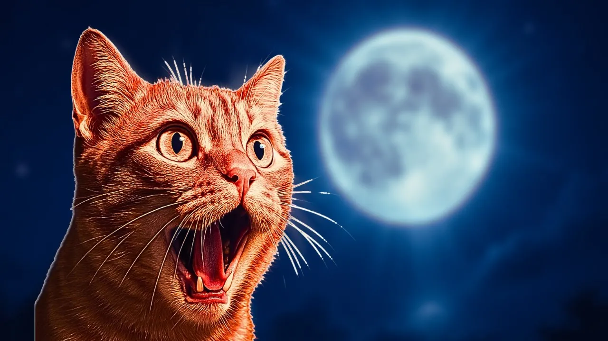

# Do Full Moons Affect Cats? The Science of Lunar Cycles

## 기본 정보
- **URL**: https://www.youtube.com/watch?v=WZWJkY6xq6c
- **채널명**: Cat Cognition
- **구독자수**: 1,490
- **조회수**: 577
- **업로드일**: 2025-05-26
- **영상 길이**: 7:23
- **댓글 수**: 7
- **좋아요 수**: 15

## 썸네일

---

## 댓글 (추천순 TOP 10)

| 순위 | 좋아요 | 댓글 |
|------|--------|------|
| 1 | 0 | The Colorado State study analyzed 11,940 cases over 11 years. The statistical vs. clinical significance distinction changes everything. Full data: https://blog.catcognition.com/do-full-moons-affect-cats |
| 2 | 1 | 3:03 Idk why he only chose crime rates and hospitals, there is a clear and well documented effect of the full moon on human sleep |
| 3 | 0 | chose the most interesting examples! |
| 4 | 0 | I get that this is science, and a lot of your points are valid, but there's also a spiritual aspect to this. |
| 5 | 2 | We have just had a full moon and my cat's behaviour has definitely  been different. I did wonder  if the moon could have an effect and that's  why I searched  for info. |
| 6 | 0 | I agree. I think there’s things that we don’t understand yet. |
