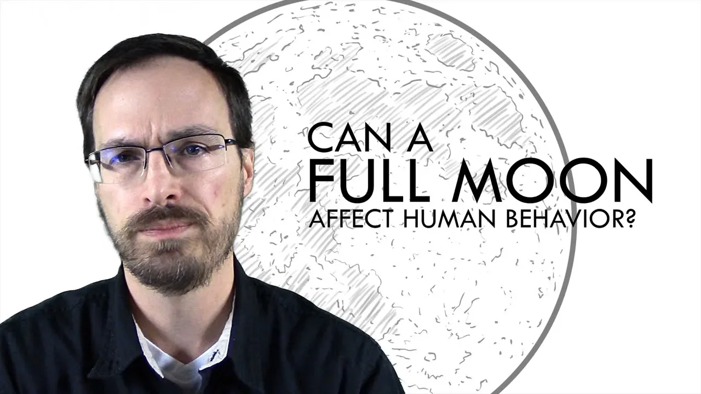

# Does the Full Moon Affect Human Behavior?

## 기본 정보
- **URL**: https://www.youtube.com/watch?v=jZt5DmE7gEk
- **채널명**: Dr. Todd Grande
- **구독자수**: 170만
- **조회수**: 389,793
- **업로드일**: 2018-10-19
- **영상 길이**: 6:36
- **댓글 수**: 426
- **좋아요 수**: 10,924

## 썸네일

---

## 댓글 (추천순 TOP 10)

| 순위 | 좋아요 | 댓글 |
|------|--------|------|
| 1 | 1,000 | The full moon makes me feel freakishly happy. Like I just want to stare at it all night. It's just so pretty and it makes me feel safe.  And I just wanna be in its light for some reason. |
| 2 | 318 | During a full moon I can't fall asleep too easily and it makes me stay awake brighteyed. |
| 3 | 623 | As somrone who worked in a mental institution for old people, who mostly had dementia, i can say that they were not only afected by the moon, but also by the wether. It was actually pretty interesting to see how everyone was in somewhat of a similar mood depending on the wether or the moon. |
| 4 | 258 | Maybe not gravity, but about the amount of light available at night due to increased moonlight?  We know that longer vs shorter daylight has an effect on mood (seasonal affective disorder).  What about moonlight? |
| 5 | 675 | Oddly I worked at a Psych ward that did experience increased patient admissions during Full Moons - to a point where the Nursing Coordinators decided to staff additional PRN nurses on those dates. It could simply be that people perceive that a full moon will cause erratic behavior - which increased that behavior leading to increased admissions... |
| 6 | 961 | I can tell you as a first responder, and emergency room medical radiation technician, that I dread working every time there’s a full moon, because, to be guttural, every creepy nightcrawler, comes into our emergency department, and always on a full moon. There may not be scientific evidence to explain how or why, but I don’t need that evidence, my own experiences are all the evidence I need. I’ve been working in healthcare for over 30 years, and I guarantee you, every single time there’s a full moon, half the staff calls in sick, because nobody wants to work it, knowing what we’re in for. I work in a major trauma centre in downtown Toronto, every time we’ve had excessive violence, mental health breakdowns, severe psychosis of varying degrees, even staff being attacked, one evening being shot to death, has always occurred on a full moon. The rest of the time it’s just the usual run-of-the-mill emergency patients, so don’t tell me there’s no evidence to suggest there’s a correlation between a full moon and human behavior, because I know for a fact that there is. |
| 7 | 0 | Correlation not causation.   How do you call in sick when you work in a hospital??? |
| 8 | 0 | I'm sure half the people calling in sick and being understaffed for every full moon doesn't help. Could be one of the reasons things feel more hectic. |
| 9 | 34 | Yes sir I am a patient of obsessive compulsive disorder ,my illness becomes worst during full moon and lunar period |
| 10 | 32 | I started noticing a pattern where my anxiety would increase and that’s why i now believe that it does effect some people. First-hand evidence. |
