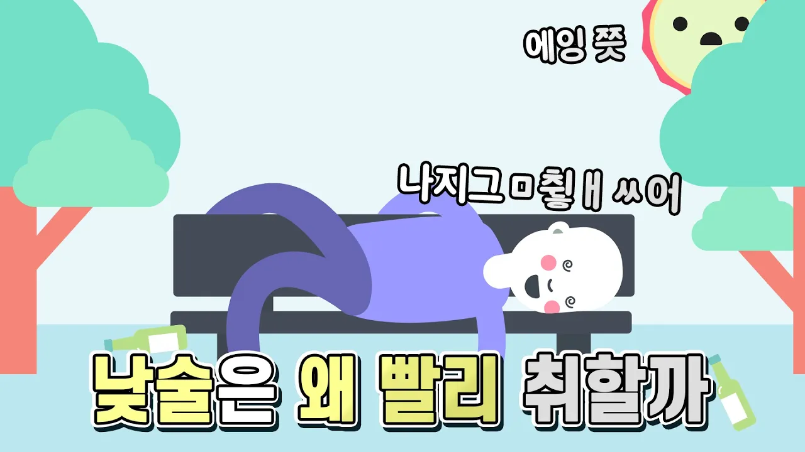

# 낮술을 마시면 왜 빨리 취하는 걸까

## 기본 정보
- **URL**: https://www.youtube.com/watch?v=Wyi5NsSGZfE
- **채널명**: 은근한 잡다한 지식
- **구독자수**: 58만
- **조회수**: 37,346
- **업로드일**: 2021-01-28
- **영상 길이**: 3:15
- **댓글 수**: 85
- **좋아요 수**: 647

## 썸네일

---

## 댓글 (추천순 TOP 10)

| 순위 | 좋아요 | 댓글 |
|------|--------|------|
| 1 | 51 | 이거 보니까 다람쥐가 숙성 배 먹고 취해서 비틀거리는 거 생각나네 ㅋㅋㅋㅋ |
| 2 | 36 | 낮술 마시고 집에 들어가시면 3초만에 주무실 수 있습니다 |
| 3 | 1 | 근데 낮에 잘 일이 많이 없음 |
| 4 | 1 | 미성년자지만 좋네요 |
| 5 | 1 | 너무 완벽해!!! |
| 6 | 1 | 아침에 마시고 낮에 취하면 낮잠을 바로 주무실 수 있습니다 |
| 7 | 32 | 가만생각해보니  밤에먹으면 8~9시 부터 새벽 2시까지 먹었는데 낮에먹을땐 12시부터 새벽 2시까치 처먹으니까 그런거같네요 자신을 되돌아보는 계기가 되었습니다 감사합니다 |
| 8 | 2 | 읽고 우는중 아,,이게맞지 |
| 9 | 21 | 술취한 캐릭터 너무 귀엽네요 ㅋㅋㅋㅋ 재미있게 보고 갑니다 |
| 10 | 6 | 썸내일 사진ㅋㅋㅋ |
