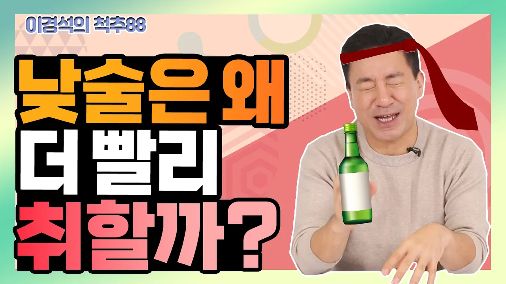

# 낮술 마시면 부모도 못 알아본다? 낮술이 더 취하는 과학적 근거는? - 이경석의 척추88 #161 - 낮술, 숙취

## 기본 정보
- **URL**: https://www.youtube.com/watch?v=95qwHHOjGIE
- **채널명**: 굿라이프
- **구독자수**: 140만
- **조회수**: 3,265
- **업로드일**: 2022-12-14
- **영상 길이**: 5:47
- **댓글 수**: 10
- **좋아요 수**: 104

## 썸네일

---

## 댓글 (추천순 TOP 10)

| 순위 | 좋아요 | 댓글 |
|------|--------|------|
| 1 | 7 | ’이경석의 척추88’에서 다뤘으면 하는 주제가 있으면 제안해주세요. 방송을 통해 궁금한 점을 풀어드리겠습니다. |
| 2 | 3 | 안녕하세요 이선생님 반갑습니다 |
| 3 | 2 | 혈관 확장일 경우~ 추운겨울에 술마시고, 따뜻한곳에 들어가면  확 취하겠네요. 그런경험이 있는듯요 |
| 4 | 3 | ㅋㅋㅋㅋㅋㅋ 오늘은 쉬어가는 시간~👍 한참을 웃었네용~😁 감사합니다~😊 |
| 5 | 1 | 술자리가 잦은 연말 특집입니다 ㅎㅎㅎ 메리크리스마스🎄😊 |
| 6 | 0 | 낮은  양이고  술은  음이기  때문에  음양의  혼조로 더  취합니다. 술은  해가진  저녁에 |
| 7 | 0 | 낮술로 46도정도 백주 반컵 정도 추천?  일에도 지장없고, 1~2시간내에 술 다 깨고,  오히려 저녁에 마시면 심박수가 올라가서 수면에 방해됩니다. . |
| 8 | 2 | 안녕하세요 척추88병원 신경외과 전문의 🍒이경석 원장님 🙏   술냄새에도 저는 어지럽고 힘들어서 전혀 술을 못 마셔서 술 먹는 사람들이 신기할 정도입니다. 술 먹은 사람들 보면 밤에 먹으면 바로 자니까 잘 모르겠던데 낮에 먹으면 바로 안 자니까 곁에서 보기에도 더 취한 것으로 보였어요. 즐거운 시간이었어요 ^^ 고맙습니다 🙏 💗 |
| 9 | 1 | 평안한 저녁 보내세요😊🎄 |
| 10 | 0 |  @굿라이프   예 고맙습니다 ^^ 편안한 밤 되세요 🙏 🍒이경석 원장님께서 꾸준히 해주셔서 참 좋고 든든해요^^💗 |
