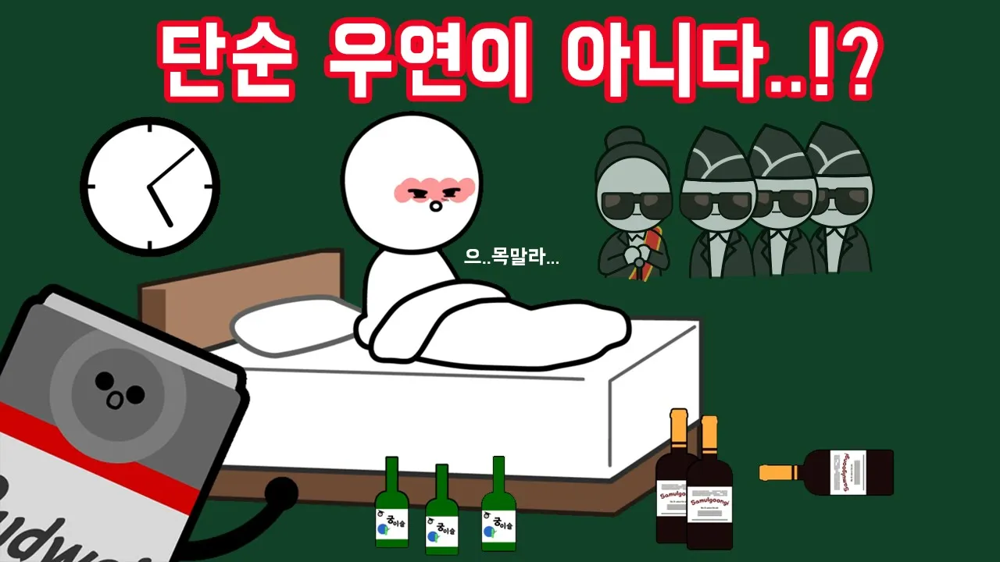

# 왜 술을 마신 다음 날에는 일찍 깨는 걸까?

## 기본 정보
- **URL**: https://www.youtube.com/watch?v=nctpsVgVE4Y
- **채널명**: Samulgoongi
- **구독자수**: 156만
- **조회수**: 965,900
- **업로드일**: 2020-07-05
- **영상 길이**: 3:19
- **댓글 수**: 1,400
- **좋아요 수**: 11,250

## 썸네일

---

## 댓글 (추천순 TOP 10)

| 순위 | 좋아요 | 댓글 |
|------|--------|------|
| 1 | 418 | 술마시고 한시간밖에 안잤는데 잠이 더이상 안오고 똘망똘망해서 검색해 들어온1인 |
| 2 | 1 | 꼬밍아 자라 ㅎ |
| 3 | 181 | 적당히 먹으면 평소처럼 깨는데 좀 많이 먹으면 일찍 일어남.. 그리고 일찍 일어난 만큼 자기 전까지 숙취로 고통받음 ㅠ |
| 4 | 5,000 | 나는 혼자 일찍깨는데 옆에친구는 겁나 잘자고있음ㅋㅋㅋ |
| 5 | 1,000 | 근데 그 친구도 한번 일어났다가 님 자는거 보고 다시 잔거임 ㅋㅋㅋ |
| 6 | 15 |  @stickyspice  아 ㅋㅋㅋㅋㅋㅋ |
| 7 | 0 |  @stickyspice  그거 나임ㅋㅋㅋㅋㅋㅋㅋㅋㅋㅋㅋ물론 미자라 술은안먹고 |
| 8 | 0 |  @stickyspice  ㄹㅇㅋㅋㅋㅋㅋㅋㅋㅋㅋㅋ |
| 9 | 552 | 이거 국룰임 |
| 10 | 0 |  @sangjingolf  ㅇㅈ 진짜 국률이닼ㅋㅋㅋㅋ  N이다! |
