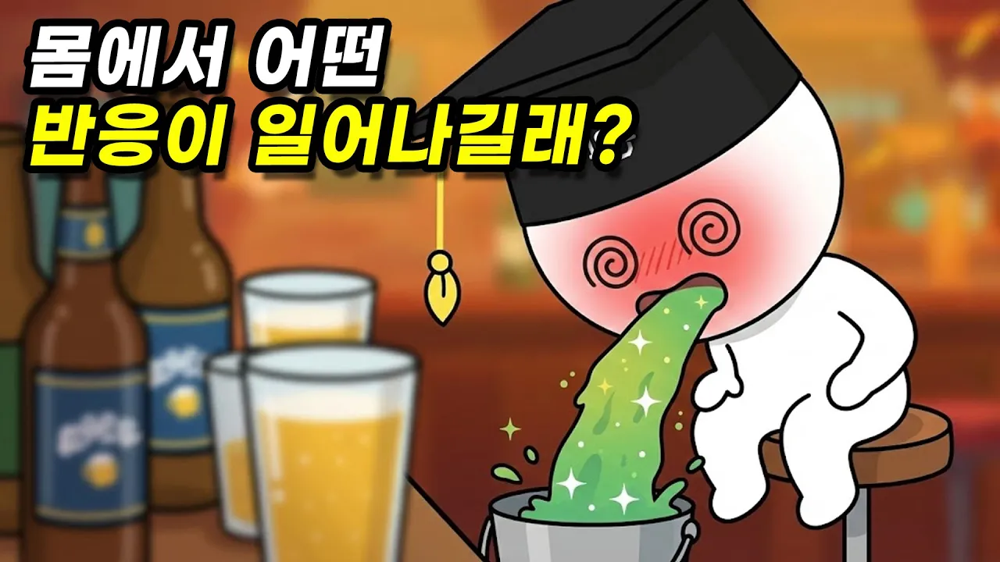

# 술을 마시면 왜 구토하고, 얼굴이 빨개질까?

## 기본 정보
- **URL**: https://www.youtube.com/watch?v=PSDYf4ebbHE
- **채널명**: Samulgoongi
- **구독자수**: 156만
- **조회수**: 193,722
- **업로드일**: 2023-08-16
- **영상 길이**: 3:23
- **댓글 수**: 229
- **좋아요 수**: 2,766

## 썸네일

---

## 댓글 (추천순 TOP 10)

| 순위 | 좋아요 | 댓글 |
|------|--------|------|
| 1 | 642 | 어디서 "사람도 맞다보면 딴딴해지면서 맷집이 늘듯 간도 술로 시달리다 보면 딴딴해지면서 맷집이 늡니다. 우린 그걸 간경화라고 하죠" 라는 얘기를 들었음. |
| 2 | 23 | 전 술마시면 는다는말 싫어함. 개인적으로 맥주 반 잔 만 먹어도 얼굴 붉어지고 심장이 미친듯이 뜀 그래서 조금씩 컨디션 보고 마시고 대도록 안마시는데 마시면 는다고 계속 권하는 사람 있음 또 어떤 분들은 몸 상태 설명하면 그냥 알아서 마시라고 권하지 않는 분들도있고요. 이러면 술자리 불편하지 않음. |
| 3 | 9 | 이상하게늘긴하더라... |
| 4 | 8 | 그건 아마 술에 적응하는게 아닌 술에 취한 상태에 적응하는걸 껍니다 몸은 이미 취했지만 정신이 그 상태에 적응해 더 들어가는 |
| 5 | 0 |  @은지수-m2w  이게 맞지 ㅋㅋㅋ. 몸은 똑같은데 뇌가 펜타닐마냥 더 높은 취기를 원하는거 |
| 6 | 0 | ​ @은지수-m2w 이게 맞지 ㅋㅋ. 몸은 똑같은데 마치 마약마냥 더 높은 취기를 원하는거. |
| 7 | 62 | 20대때 주량 소주 한병 먹으면 기절, 현재 30대 주량 3병. 건강검진 간수치 매우 정상... 단련되는게 아주 허무맹랑한 소리는 아닌거 같아요 |
| 8 | 12 | ​ @Catenaccio-3  '주량이 늘었다' 를 '술을 요령껏 마신다' 로 해석하면 맞는말인것 같아요. 20 대 땐 단시간에 많은량의 술을 마셔서 한병마시고 기절하셨고, 현재는 마시는 속도를 요령있게 조절하면서 마시니 양은 많더라도 긴 시간에 걸쳐서 마시니 괜찮은 것이고요. 사실 주량이라는게 시간당 몇 리터 같이 수치화된게 아니니 사람마다 기준이 다르기도 하고 술이 몸에 정말 안맞는 사람도 있어요마시는게 위험할 정도로요 |
| 9 | 79 | ​ @Catenaccio-3  주량은 먹어서 늘 수 있는 게 아니라고 하셨어요. https://youtu.be/0Kkw0zRrDyM |
| 10 | 8 |  @ninety-one0409  의학적으로는 그럴지 몰라도 저는 제가 체감했어요 물론 몸무게는 15키로 이상 더 나갑니다 그때랑 비교해서 |
