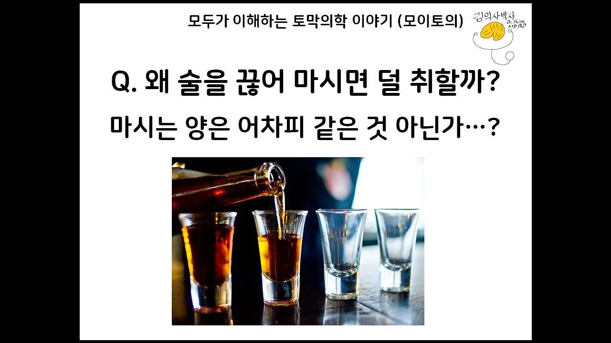

# 왜 술을 천천히 마시면 덜 취할까? 마시는 양은 어차피 같지 않나? [모이토의] [김의사박사]

## 기본 정보
- **URL**: https://www.youtube.com/watch?v=lWxZKBVWWD4
- **채널명**: Dr. Kim, MD PhD
- **구독자수**: 2만
- **조회수**: 1,676
- **업로드일**: 2019-09-21
- **영상 길이**: 9:01
- **댓글 수**: 9
- **좋아요 수**: 42

## 썸네일

---

## 댓글 (추천순 TOP 10)

| 순위 | 좋아요 | 댓글 |
|------|--------|------|
| 1 | 1 | 와~~~~~정말 쉽게 설명해주시네요~!!!! |
| 2 | 1 | 과학 시간에 과학 선생님 설명 듣는 느낌이네요ㅎㅎ 궁금증 해소 하고 갑니다ㅋㅋㅋ 빨리 마시지 말아야지...ㅎ |
| 3 | 2 | 제가 빨리 죽었던 이유를 확실하게 알았네요ㅋㅋㅋ |
| 4 | 0 | 안녕하세요 제 영상이 도움이 되었다니 기쁩니다! ^^ |
| 5 | 1 | 빨리 마셔야겠네요~♥ 가성비 좋게~^^ 좋은 정보 감사~~~(알콜뿌셔뿌셔~) |
| 6 | 0 | 그렇게 생각할 수도 있겠네요^^ 빠르게 마시면 빨리 취하게 되니 취하는 것이 목적이라면 빠르게 마시면 됩니다! |
| 7 | 1 | 영상 잘봤습니다, 오늘 영상을보니 평소에 궁금했는데 해결이되었네요 궁금한게있는데 술을마시면서 물을 많이마시는게 좋은데 물,이온음료,에너지드링크 이 셋중에 어느게 더 혈중알콜농도가 올라가는 시간을 지연시키는지 궁금합니다 |
| 8 | 0 | 안녕하세요 찾아보니 숙취해소에 에너지음료나 이온음료에 대해 미신은 많으나 과학적인 근거는 미흡하다고 합니다. 숙취라는 것이 정량하기 어렵다 보니, 연구를 해도 결과가 차이가 있다고 나오는 경우도 있으나 상당수의 연구는 별 차이 없다고 나오네요. 아직 잘 모르는 것 같습니다. 근데 알콜대사에 당이 필요하다 보니까 당이랑 수분을 많이 먹으면 도움이 될것입니다! 외국에선 한국의 갈아만든 배가 숙취해소음료로 유명하다고 하네요ㅎㅎ |
| 9 | 1 | 답변감사합니다ㅎㅎ 갈아만든 Idh로 유명하죠 |
