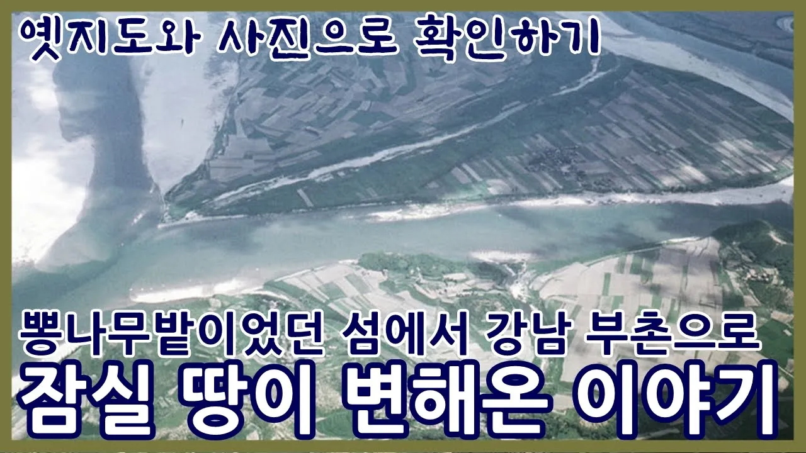

# 잠실 이야기ㅣ 뽕나무밭이었던 섬이 강남 부촌으로 변한 사연ㅣ육지에서 섬이 됐다가 다시 육지가 된 잠실

## 기본 정보
- **URL**: https://www.youtube.com/watch?v=S8158pOL9ts
- **채널명**: 대한여지도 Korean Geographic
- **구독자수**: 12만
- **조회수**: 54,307
- **업로드일**: 2025-12-14
- **영상 길이**: 5:45
- **댓글 수**: 42
- **좋아요 수**: 598

## 썸네일

---

## 댓글 (추천순 TOP 10)

| 순위 | 좋아요 | 댓글 |
|------|--------|------|
| 1 | 7 | 내용 중에 있는, 1930년대 송파나루가 물에 잠기고 돛단배가 떠있는 풍경사진(1분30초)을 송파구청에 제공한 사람으로서 설명을 덧붙이겠습니다. 사진을 보시면 마치 항공사진 처럼 높은 곳에서 촬영한 것임을 느낄수 있을 겁니다. 한강 본류이던 석촌호수 남쪽으로는 지금의 방이동과 송파에 걸쳐  야산지대가 있었지요. 그 야산들을 1969년경 대규모 토목공사로 까뭉갠 흙으로 한강 본류를 동서 양쪽으로 막아서 만들어진 게 석촌 호수입니다. 전술한 송파나루 흑백사진은 그 야산들 중 가장 높은 봉우리에서 찍은 사진이며 위치는 지금의 송파여성문화회관 뒷쪽으로 약간의 언덕진 곳 일대입니다. |
| 2 | 1 | 생생한 설명 감사합니다! |
| 3 | 7 | 잠실주공에서 부터 48년째 살고 있는데 어릴때 한강에서 물고기 가재잡고 도마뱀 달팽이도 많았는데..땅콩도 캐고...ㅠㅠ |
| 4 | 17 | 잠실 주민인데, 너무 재밌고 유익한 영상이네요!! 굳굳 |
| 5 | 7 | 잠실을 제대로 알 수 있었습니다. |
| 6 | 16 | 오래전 아버지가 저기 수천평 농사짓는데 여름방학때 도시락 배달하던 기억이 나네  아버지 지인은 돼지 키우고 귀갓길에 해가 뉘였 넘어 갈 때면 개구리 울음 소리에 대화가 안될 정도 잡초에 흙먼지 투성이 였었는데 |
| 7 | 5 | 목동도 80년대초까지 비슷했음 |
| 8 | 4 | 목동도 개발전인 80년대초까지 농촌이었음 |
| 9 | 2 | 땅 그대로 갖고 계셨으기를 바랍니다. 🎉🎉🎉🎉🎉 |
| 10 | 4 | 역사공부가 되고 지식을 넗히는 영상. 최고입니다. |
