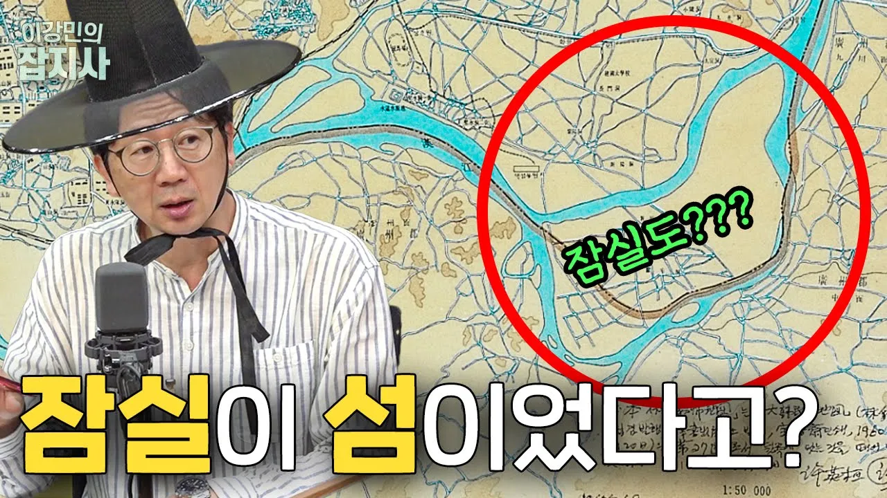

# 원래 섬이었던 잠실.. 아, 아니 잠실도..? 서울 지명의 역사 2편

## 기본 정보
- **URL**: https://www.youtube.com/watch?v=CWLYDYbXsAU
- **채널명**: 이강민의 잡지사
- **구독자수**: 37만
- **조회수**: 70,086
- **업로드일**: 2023-06-27
- **영상 길이**: 26:33
- **댓글 수**: 41
- **좋아요 수**: 1,299

## 썸네일

---

## 댓글 (추천순 TOP 10)

| 순위 | 좋아요 | 댓글 |
|------|--------|------|
| 1 | 12 | 서론 00:50 일제의 흔적이 남은 지명? 03:06 구독자 질문 - 신도림/대림/오류/목동  본론 05:18 구로구 👴🏻👴🏻👴🏻👴🏻👴🏻👴🏻👴🏻👴🏻👴🏻 06:25 양천구 / 양평 (feat. 겸재 정선) 09:41 한 때 ‘섬’이었던 잠실 🐛 12:10 선정릉의 비밀  15:39 면목동이 부끄러웠던(?) 박광일 씨 17:34 무덤이 없는데 ‘능동’? 19:01 도시마다 있었던 종로 🔔 21:19 일본식 지명, ’종로 n가‘  결론 24:23 팔도유람! 서울 다음 목적지는~? |
| 2 | 0 | 잠실은 정말 생각지도 못했어요 흥미진진해요 감사합니다 |
| 3 | 15 | 갓광일. 갓강민 어후❤❤❤ |
| 4 | 5 | 지난주까지 한국에 있다 미국 돌아왔는데... 기차 여행 해 보니 한국 지명에 '산'이랑 '천' 들어간 이름이 참 많아 보였어요. |
| 5 | 10 | 서울에서 반백년을 살아도 몰랐던 지명의 유래를 알게 되니 서울에 대한 애정이 샘솟네요! 갓광일과 강민 도령을 서울 홍보대사로~~~😂🫶💞💘 |
| 6 | 4 | 드뎌 충청으로 오는군요.  기다립니다~ |
| 7 | 2 | 두 분 갓이 너무 잘 어울리세요.. 편집장님 혹시 보부상이신가요 ㅎㅎ |
| 8 | 4 | 회식 끝나고 보는 잡지사도 매력있네요 오늘도 잘 밨읍니다~ |
| 9 | 3 | 편집장님 저 돌림판  어디서 많이 봤는데 말입니다 ㅋㅋㅋㅋ |
| 10 | 5 | 서울3편 좋아요 ❤❤❤❤❤ |
