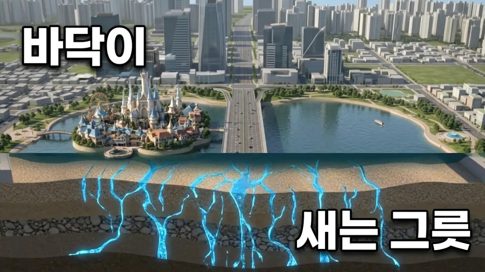

# 석촌호수는 지금도 새고 있습니다 — 매일 2천 톤

## 기본 정보
- **URL**: https://www.youtube.com/watch?v=G8eMsslphAM
- **채널명**: 신비한 건축사전
- **구독자수**: 80만
- **조회수**: 1,018,840
- **업로드일**: 2026-08-16
- **영상 길이**: 4:56
- **댓글 수**: 908
- **좋아요 수**: 9,476

## 썸네일

---

## 댓글 (추천순 TOP 10)

| 순위 | 좋아요 | 댓글 |
|------|--------|------|
| 1 | 613 | 단일종목 레버리지 하셨나요? |
| 2 | 170 | 절대 아닙니다. 무슨 그런 무서운 말씀을 ㅎㅎ |
| 3 | 121 | 아 왜 이렇게 열심히 하나 그런 뜻인가 ㅋㅋ  아 난 지금 처음 알게된 채널이었는디... 57만 채널이구나. 홧팅홧팅 |
| 4 | 13 |  @SoakedBurrito 1일전 댓글인데 환장할노릇이네 60만 채널입니다 |
| 5 | 4 |  @콩이에비 1일전 댓글인데 환장할 노릇이네 63만입니다 |
| 6 | 0 | ​@y__kko지금 65만ㅋㅋ 상승률 ㄹㅈㄷ네 |
| 7 | 86 | ㅋㅋㅋㅋㅋㅋ 왜캐 열심히 하냐는 글을 이렇게 살벌하게ㅋㅋㅋ |
| 8 | 22 | 아무생각없이봣다가 터졋넼ㅋㅋ |
| 9 | 18 | 내년부터 유투브 수익내기 빡세지니까 서두르는거죠 구독자 더 늘리고 조회수 올리려면 열심히 하겠죠 |
| 10 | 13 |  @세상참꽃같네  최초수익조건이 빡세지는거라 뭐 지금 이 유튜버가 서두를게 있나요..? |
