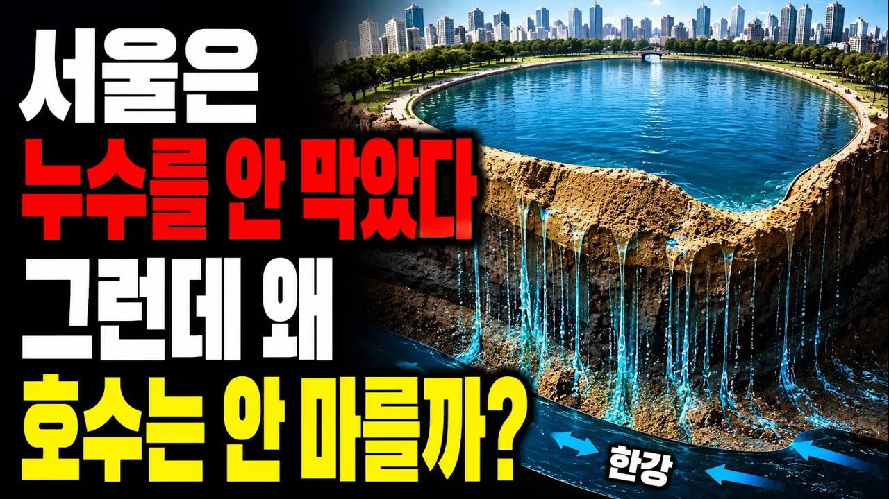

# 하루 2천 톤 새는데, 서울은 왜 석촌호수를 막지 않았을까?

## 기본 정보
- **URL**: https://www.youtube.com/watch?v=cpDHxILURfA
- **채널명**: 대한민국 작동원리
- **구독자수**: 107
- **조회수**: 569
- **업로드일**: 2026-09-03
- **영상 길이**: 9:43
- **댓글 수**: None
- **좋아요 수**: 8

## 썸네일

---

## 댓글 (추천순 TOP 10)

| 순위 | 좋아요 | 댓글 |
|------|--------|------|
