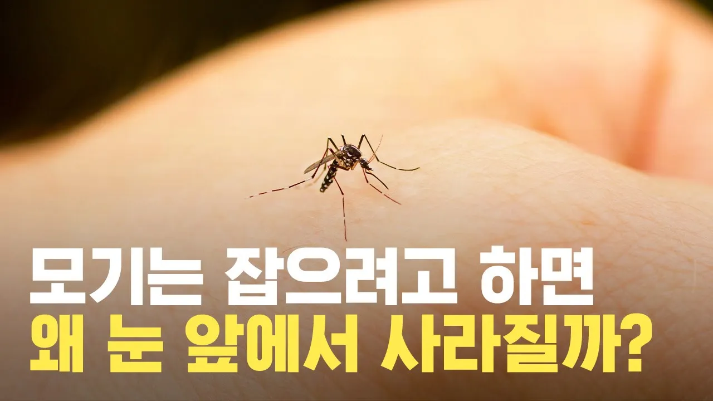

# 모기가 눈 앞에서 순식간에 사라지는 이유는?

## 기본 정보
- **URL**: https://www.youtube.com/watch?v=85SXNRbjkic
- **채널명**: Sotam
- **구독자수**: 44만
- **조회수**: 11,194
- **업로드일**: 2020-10-21
- **영상 길이**: 4:09
- **댓글 수**: 22
- **좋아요 수**: 206

## 썸네일

---

## 댓글 (추천순 TOP 10)

| 순위 | 좋아요 | 댓글 |
|------|--------|------|
| 1 | 2 | 모기를 잡으려고 생각하면 모기가 사라지는 이유가 알고픈건데 , 텔레파시라도 있나? |
| 2 | 10 | 본인 방금 야스오 되는 상상함 ㅋㅋㅋ  나 괴롭히던 모기들,,,,ㅋㅋㅋㅋㅋ  우선 내 머리 위에서 엥엥거리던 모기ㅋㅋㅋㅋ  바람의 장막(W) 로 막아버리고 강철폭풍(Q)ㅋㅋㅋㅋㅋㅋㅋ  모기 자식들 미안하다고 도망가지만 이미늦음ㅋㅋㅋㅋㅋ  일단 순식간에 불켜서 벽 스캔하면서 모기들 하나하나 질풍검(E) 타주고 ㅋㅋㅋ  모기들 빤스런하는데 내 사정거리에서 벗어나기 불가능ㅋㅋㅋㅋ1초마다 평큐평큐평큐!!!  제발 살려달라고 싹싹비는데 어림도없지. 바로 회오리 날리고 최후의 숨결(R) 점화큐평. |
| 3 | 1 | ㅋㅋㅋㅋㅋㅋㅋㅋㅋㅋㅋㅋㅋㅋㅋㅋㅋㅋ아 미쳤네 이사람 |
| 4 | 4 | 아니 나레이션 너무 귀여운데요 걍 사투리 써주시면 안됩니까ㅋㅋㅋㅋㅋ앞으로 모기 잡을때 멀리보고 잡아야겠네 |
| 5 | 13 | 모기 날개짓 분석하는 건 처음보네요ㅋㅋㅋ |
| 6 | 2 | 학교 발표에 영상을 활용해도 될까요? 정리도 깔끔하고 자료도 신빙성 있어보여 부탁드립니다 |
| 7 | 2 | 모기 개빡치네 오늘 내 귀랑 발목 물고 사라져있음 개빡쳐 |
| 8 | 0 | 유그린 F |
| 9 | 6 | 모기는 그 소리가 최악임.. 잘 올라하다 그 소리가 나면 소름이 끼치면서 잠이 확 달아남… 제발 내 피 줄테니까 소리 좀 내지 말렴… |
| 10 | 3 | 나 과알못인데.. 이해 잘되네... |
