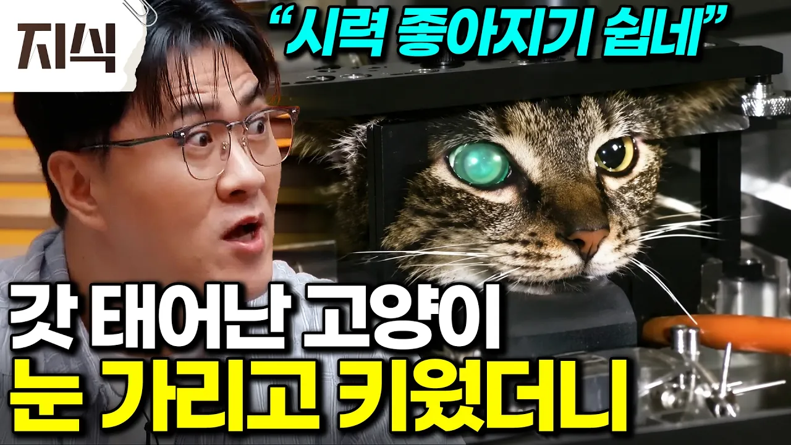

# “뇌가 열려야 앞이 보입니다" 눈알 1600개보다 2개가 강력한 이유｜초파리와 고양이를 통해 본 인간 시력의 비밀 #과학 #EBS지식

## 기본 정보
- **URL**: https://www.youtube.com/watch?v=VHcD74qk1Xg
- **채널명**: EBS 지식
- **구독자수**: 31만
- **조회수**: 41,998
- **업로드일**: 2026-08-10
- **영상 길이**: 39:47
- **댓글 수**: 21
- **좋아요 수**: 245

## 썸네일

---

## 댓글 (추천순 TOP 10)

| 순위 | 좋아요 | 댓글 |
|------|--------|------|
| 1 | 4 | 일론머스크의 논리가 맞네. 눈이 아무리 좋아도 뇌가 멍청하면 못 본다는 논리. |
| 2 | 1 | 사시 약시교정할때 한쪽눈 가림 치료 하죠 엄청 효과 좋습니다 |
| 3 | 2 | 정말 신기하군요!😮 |
| 4 | 2 | 당연한게 없구나 알수록 ㅎㅎ 사람 몸도 알수륙 진짜 신기하네요 |
| 5 | 0 | 그래서 파리를 뒤에서 잡을래도 도망가버리는거구나 |
| 6 | 4 | 초점 조절은 자율신경 상태와 기능을 따르고, 반사기전 이용한 운동과 리커버리로 관리할 수 있는데, 한국의 안과/안경 쪽은 수술과 장사로 돌리고, 스포츠는 무관심과 무시로 일관... 인지와 의사결정 뿐 아니라 밸런스(무의식적 고유수용감각, 배스티불라, 무의식적 시각정보처리), 리듬, 소뇌자극, 둘레계통 활성화, 자율신경계와 호르몬까지 연결되어 있지만, 전문가라는 사람들 모두 뇌, 눈, 신체활동 통합하지 않고 학교에서 받은 자기 학위 전공으로만 풀어내려 하고 자기들만 최초로 뭘 만들고 있는 것처럼 언플하고 다녀서 산업이 안커지는게 팩트. 이 영역은 1978년 미국 스포츠비전 트레이닝 시작이 원조였음. 인간 눈은 망막 앞에 혈관이 가리고 있어도 뇌와 고시미동 같은 기능 덕에 볼 수 있고, 망막 사진으로 대사질환과 뇌, 심장, 신장 기능을 측정할 수 있음. (눈을 감고 있어야 진짜 휴식) |
| 7 | 0 | 돈때문이예요 그분들도 그게 정석이고 원복 방법이란걸 대부분의 의사들이 알고 있습니다 그런데 돈이 안되다 보니... |
| 8 | 0 | 유튜브 장문충글 정독하긴 처음이네 |
| 9 | 0 |  @호랑이훅-n2g 그냥 충보단 낫죠^^ 마늘 드세요. 사람 될 수 있음 |
| 10 | 2 | M인줄ㄷㄷ |
