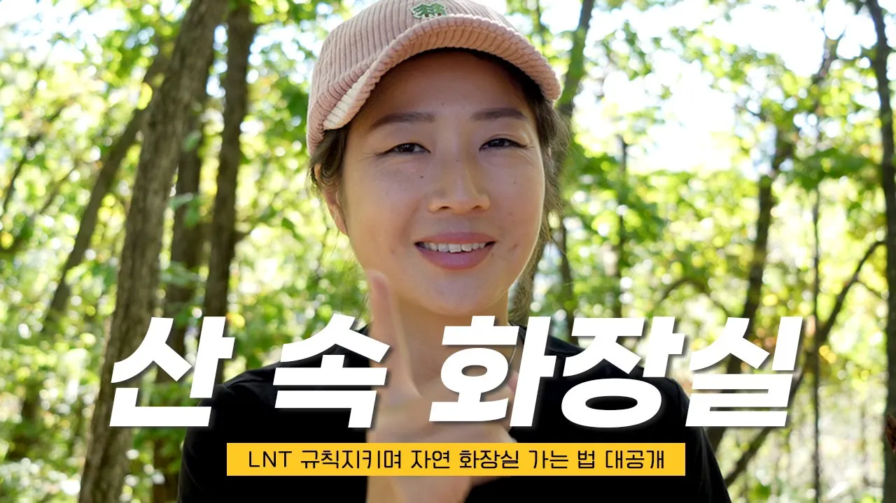

# 등산 중 산에서 화장실을 가고 싶을 때 | LNT 지키며 화장실 가는 법

## 기본 정보
- **URL**: https://www.youtube.com/watch?v=Nu95mx5HBZ4
- **채널명**: the great honeymoon
- **구독자수**: 2만
- **조회수**: 25,787
- **업로드일**: 2022-10-05
- **영상 길이**: 15:03
- **댓글 수**: 86
- **좋아요 수**: 704

## 썸네일

---

## 댓글 (추천순 TOP 10)

| 순위 | 좋아요 | 댓글 |
|------|--------|------|
| 1 | 12 | 맞아요. 뒷처리 후 휴지나 물휴지가 많지요. 자연을 위해 귀찮지만 세심한 배려와 행동이 필요합니다. |
| 2 | 1 | 외국에서도 문제가 되는 경우가 많다고 해요. 그래서 산속에 화이트 플라워(하얀 휴지 쓰레기)가 피어있다고 표현 하더라고요. 우리 모두를 위해 흔적 남기지 않기 운동을 실천하면 좋을 것 같아요!!! |
| 3 | 15 | 산에서 정말 중요한 말씀이에요.  어느 누구도 이문제를 말씀하신 분이 많이 없는거 같아요. 항상 응원합니다. |
| 4 | 1 | 앞으로도 좋은 영상과 정보로 찾아뵙겠습니다. 아자아자 |
| 5 | 12 | 등산유투브 많이 보지만 정말 어느누구도 얘기하지 않았던, 어쩌면 얘기하고 싶지 않았던 부분들이네요. 잘 보고 삽니다. 정말 유익한 내용이네요 |
| 6 | 0 | 앞으로도 좋은 영상으로 찾아올께요~ 많은 관심 부탁드립니다!! |
| 7 | 2 | 뭐 이런걸 얘기하나 싶었는데.. 꼭 각자가 알아야 행해야 할 이야깁니다~차분하게 조리있게 얘기하시는게 참 보기 좋습니다~ |
| 8 | 3 | 응가는  땅파서 해야죠 ~~~~~ 그러나 휴지나 물티슈는 꼭 챙겨서와야되고  보통 땅파고 응가하고 똥지는 응가위에덮고 불로 태운다음 흙을 다시 덮는걸로 알고 있는데  혹시 불날수있으니 흙덮고 똥지 챙겨오는게 좋을듯 합니다 |
| 9 | 1 | 정말 유익하네요 감사합니다 |
| 10 | 5 | 100퍼 공감합니다 좋은정보 감사합니다~ |
